# System Architecture

## Overview

This document describes the architecture of the Advanced AI Agent system - an intelligent SQL agent that works with MySQL databases containing 100+ tables. The system uses LangGraph workflows, graph algorithms for join path discovery, and secure views for encrypted data access.

## System Components

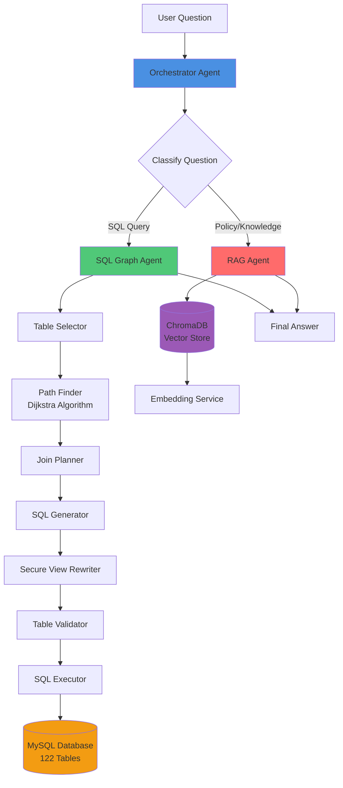

## Core Agents

### 1. Orchestrator Agent

The main entry point that routes questions to appropriate agents.

**Location**: `src/agents/orchestrator_agent.py`

**Workflow**:
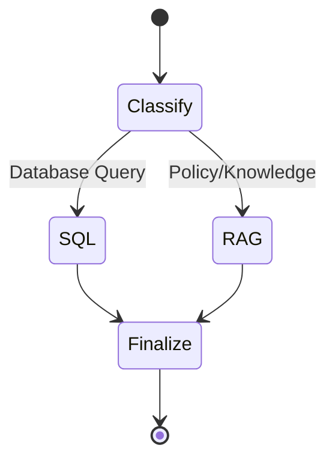

**Responsibilities**:
- Classifies user questions (SQL vs RAG)
- Routes to SQL Agent or RAG Agent
- Formats final answers
- Manages conversation state

**State Schema**:
```python
class AgentState(TypedDict):
    messages: List[BaseMessage]    # Conversation history
    question: str                   # User question
    next_step: str                  # Routing decision
    sql_result: str | None          # SQL agent output
    rag_result: str | None          # RAG agent output
    final_answer: str | None        # Final response
```

### 2. SQL Graph Agent

Advanced SQL agent that uses graph algorithms to discover optimal join paths.

**Location**: `src/agents/sql_graph_agent.py`

**Workflow**:
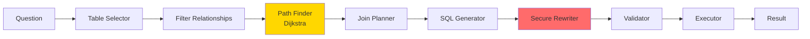

**Key Features**:
- **Table Selection**: LLM selects 3-8 relevant tables from 122 available
- **Path Finding**: Uses Dijkstra's algorithm to find shortest join paths
- **Join Planning**: Discovers transitive paths (multi-hop joins)
- **Secure Views**: Automatic rewriting of encrypted tables
- **Validation**: Pre-execution table validation prevents hallucinations

**State Schema**:
```python
class SQLGraphState(TypedDict):
    question: str
    tables: List[str]
    allowed_relationships: List[Dict]
    join_plan: str
    sql: str
    result: Optional[str]
    retries: int
    final_answer: Optional[str]
```

### 3. RAG Agent

Retrieval-Augmented Generation agent for policy and compliance questions.

**Location**: `src/agents/rag_agent.py`

**Workflow**:
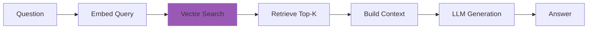

**Data Sources**:
- Company handbook
- Compliance documents (OSHA, FLSA)
- State regulations
- Work log descriptions

## Join Graph Pipeline

The system uses a sophisticated join graph to understand relationships between 122 tables.

### Pipeline Overview

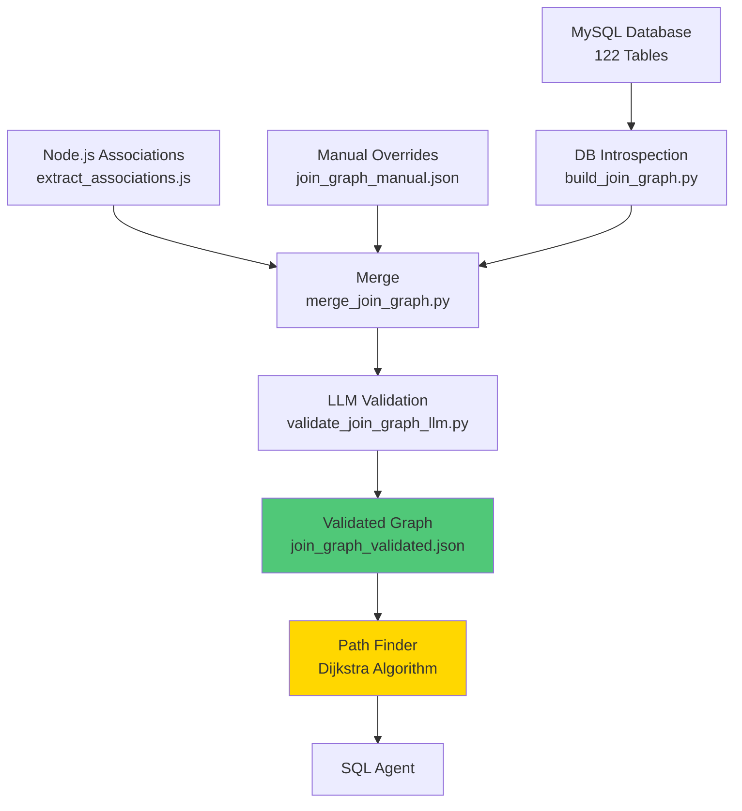

### Graph Structure

```json
{
  "version": 1,
  "tables": {
    "employee": {
      "columns": ["id", "firstName", "lastName", ...],
      "unique_columns": ["id"]
    },
    ...
  },
  "relationships": [
    {
      "from_table": "workTime",
      "from_column": "employeeId",
      "to_table": "employee",
      "to_column": "id",
      "type": "foreign_key",
      "confidence": 1.0,
      "cardinality": "N:1"
    },
    ...
  ]
}
```

### Path Finder

**Location**: `src/utils/path_finder.py`

Uses Dijkstra's algorithm to find shortest join paths between tables:

```python
path_finder = JoinPathFinder(relationships, confidence_threshold=0.7)
path = path_finder.find_shortest_path("employee", "customer", max_hops=4)
# Returns: [rel1, rel2, rel3] - shortest path
```

**Performance**:
- **Before**: Exponential complexity (never finished)
- **After**: O((V + E) log V) - < 100ms per query
- **Caching**: O(1) for repeated paths

## Secure Views Architecture

Prevents LLM hallucination of non-existent `secure_*` tables through explicit mapping.

### Three-Layer Architecture

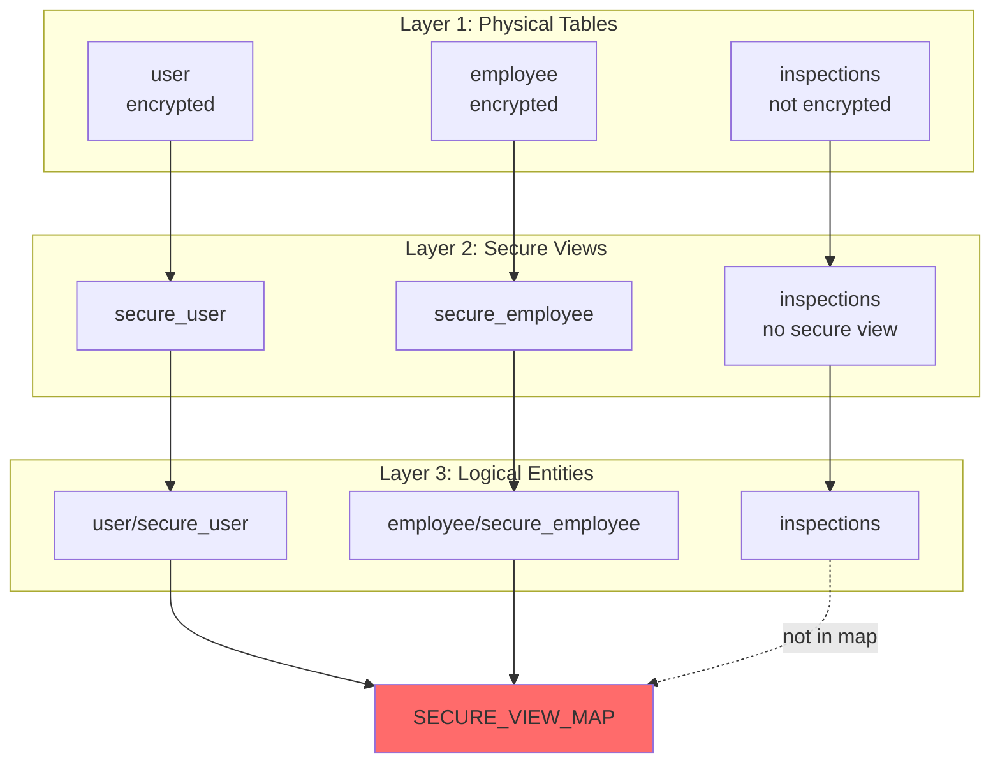

### Secure View Map

**Location**: `src/sql/secure_views.py`

```python
SECURE_VIEW_MAP = {
    "user": "secure_user",
    "employee": "secure_employee",
    "workOrder": "secure_workorder",
    "customer": "secure_customer",
    "customerLocation": "secure_customerlocation",
    "customerContact": "secure_customercontact",
}
```

**Key Rules**:
1. Only tables in `SECURE_VIEW_MAP` get `secure_*` variants
2. LLM uses logical names (e.g., `employee`)
3. System rewrites deterministically (`employee` → `secure_employee`)
4. Validation prevents hallucinations before execution

### Rewriting Flow

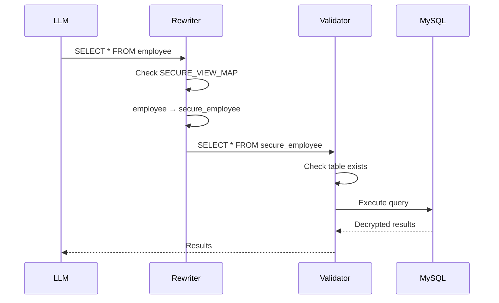

## API Architecture

### Internal API Service

The system exposes a FastAPI internal service following the Backend-for-Frontend (BFF) pattern.

**Location**: `src/api/`

**Architecture**:
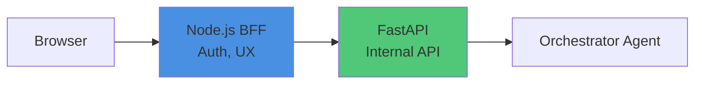

### Endpoint

**POST** `/internal/chat/stream`

**Request**:
```json
{
  "input": {
    "message": "How many technicians are active?"
  },
  "conversation": {
    "id": "conv-uuid-123",
    "user_id": "user-456",
    "company_id": "company-789"
  }
}
```

**Response** (Server-Sent Events):
```
data: {"event":"route_decision","route":"sql"}

data: {"event":"tool_start","tool":"sql_agent"}

data: {"event":"token","channel":"final","content":"There"}

data: {"event":"token","channel":"final","content":" are 10"}

data: {"event":"complete","stats":{"tokens":15}}
```

### Event Types

| Event | Description |
|-------|-------------|
| `route_decision` | Agent routing decision (SQL/RAG) |
| `tool_start` | Tool execution beginning |
| `token` | Content token with channel |
| `complete` | Stream finished |
| `error` | Error occurred |

## Data Flow

### SQL Query Flow

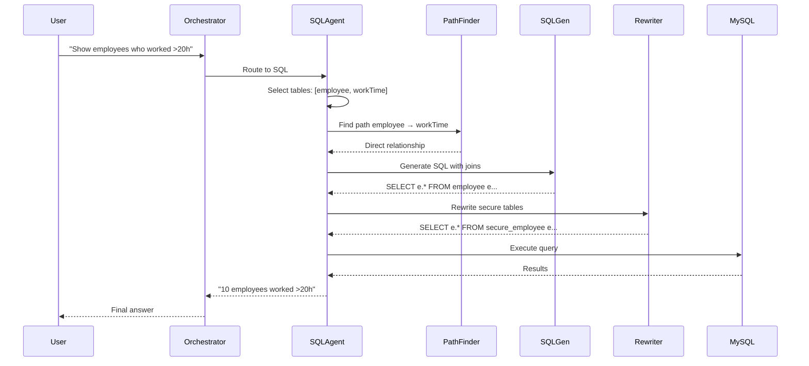

### RAG Query Flow

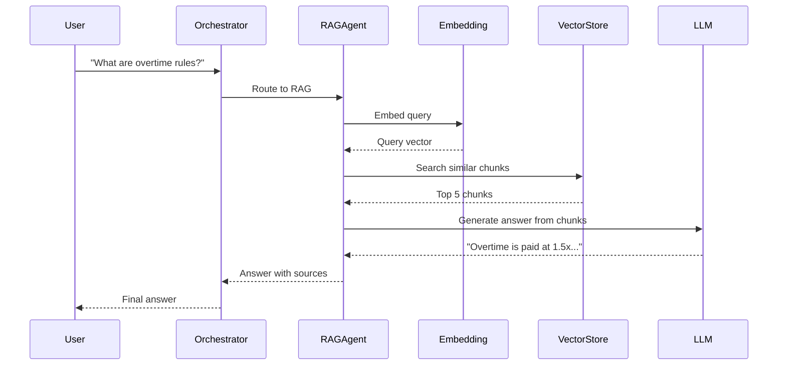

## Database Configuration

### MySQL Connection

**Location**: `src/models/database.py`

**Connection String**:
```python
mysql+pymysql://{user}:{password}@{host}:{port}/{database}
```

**Connection Pooling**:
- Pool size: 5
- Max overflow: 10
- Pool recycle: 3600 seconds
- Pool pre-ping: Enabled

### Session Variables

MySQL session variables are set automatically on connection:

```python
SET @aesKey = '{encryption_key}'
SET @customerIds = NULL
SET @workOrderIds = NULL
SET @serviceLocationIds = NULL
```

**Purpose**: Enable secure views to decrypt encrypted fields using `AES_DECRYPT()`.

## Security Architecture

### Secure Views Access Control

1. **Base tables excluded**: Encrypted base tables are hidden from SQL agent
2. **Secure views exposed**: Only secure views are visible in schema
3. **Automatic rewriting**: System rewrites queries to use secure views
4. **Validation**: All table references validated before execution

### Encryption Flow

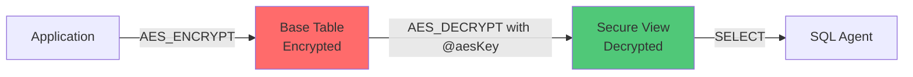

## Performance Characteristics

### SQL Agent Performance

| Operation | Time | Notes |
|-----------|------|-------|
| Table Selection | 1-2s | LLM call |
| Path Finding | <100ms | Dijkstra algorithm |
| SQL Generation | 1-2s | LLM call |
| Query Execution | 0.5-5s | Depends on query |
| **Total** | **3-10s** | End-to-end |

### RAG Agent Performance

| Operation | Time | Notes |
|-----------|------|-------|
| Query Embedding | <100ms | Cached: <1ms |
| Vector Search | 10-50ms | ChromaDB |
| LLM Generation | 1-3s | Depends on context |
| **Total** | **1-4s** | End-to-end |

### Caching Strategy

- **Embeddings**: Disk cache (`data/embeddings_cache/`)
- **Path Finder**: In-memory cache (per session)
- **Join Graph**: Loaded once at startup

## Scalability Considerations

### Current Limits

- **Tables**: 122 (tested)
- **Relationships**: 1,801
- **Max Hops**: 4 (configurable)
- **Context Window**: 128K tokens (gpt-4o-mini)

### Optimization Strategies

1. **Table Selection**: Limit to 3-8 tables per query
2. **Schema Sampling**: Reduce sample rows (currently 1-3)
3. **Path Caching**: Cache computed paths
4. **Query Limits**: Always use LIMIT clauses

## Technology Stack

| Component | Technology | Purpose |
|-----------|-----------|---------|
| **LLM** | OpenAI GPT-4o-mini | Natural language understanding |
| **Workflow** | LangGraph | Agent orchestration |
| **Database** | MySQL + SQLAlchemy | Data storage |
| **Vector DB** | ChromaDB | Document embeddings |
| **API** | FastAPI | Internal service |
| **Streaming** | Server-Sent Events | Real-time responses |
| **Path Finding** | Dijkstra Algorithm | Join path discovery |

## Key Design Decisions

### 1. Graph-Based Join Discovery

**Why**: Traditional SQL agents struggle with 100+ tables. Graph algorithms find optimal paths efficiently.

**How**: Dijkstra's algorithm finds shortest paths between selected tables.

**Benefit**: Discovers multi-hop joins automatically.

### 2. Secure Views Pattern

**Why**: Prevents LLM from hallucinating non-existent `secure_*` tables.

**How**: Explicit mapping + deterministic rewriting + validation.

**Benefit**: Zero hallucination errors, fail-fast validation.

### 3. Internal API Pattern

**Why**: Separates AI logic from frontend concerns.

**How**: BFF pattern - Node.js handles auth/UX, Python handles agents.

**Benefit**: Clean separation, reusable, secure.

### 4. On-Demand Path Finding

**Why**: Precomputing all paths is exponential.

**How**: Compute paths only for selected tables using Dijkstra.

**Benefit**: Efficient, scalable, cached.

## Future Enhancements

1. **Memory Management**: Conversation history with LangGraph checkpointing
2. **Query Optimization**: Cost-based query plan analysis
3. **Semantic Table Selection**: Use embeddings to find relevant tables
4. **Multi-Tenancy**: Company-specific data isolation
5. **Monitoring**: LangSmith integration, metrics, tracing
