# System Architecture

## Overview

This document describes the architecture of the Advanced AI Agent system - an intelligent SQL agent that works with MySQL databases containing 100+ tables. The system uses LangGraph workflows, graph algorithms for join path discovery, and secure views for encrypted data access.

## API Architecture

### Internal API Service

The system exposes a FastAPI internal service following the Backend-for-Frontend (BFF) pattern.

**Location**: `src/api/`

**Architecture**:
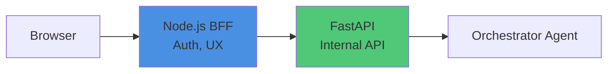

### Endpoint

**POST** `/internal/chat/stream`

**Request**:
```json
{
  "input": {
    "message": "How many technicians are active?"
  },
  "conversation": {
    "id": "conv-uuid-123",
    "user_id": "user-456",
    "company_id": "company-789"
  }
}
```

**Response** (Server-Sent Events):
```
data: {"event":"route_decision","route":"sql"}

data: {"event":"tool_start","tool":"sql_agent"}

data: {"event":"token","channel":"final","content":"There"}

data: {"event":"token","channel":"final","content":" are 10"}

data: {"event":"complete","stats":{"tokens":15}}
```

### Event Types

| Event | Description |
|-------|-------------|
| `route_decision` | Agent routing decision (SQL/RAG/GENERAL) |
| `tool_start` | Tool execution beginning |
| `token` | Content token with channel |
| `complete` | Stream finished |
| `error` | Error occurred |

## System Components

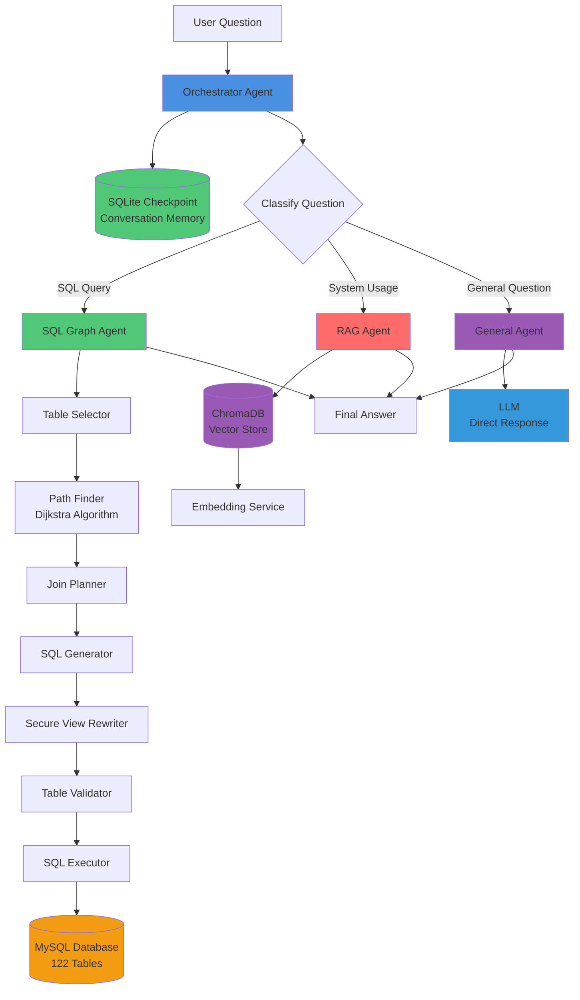

## Core Agents

### 1. Orchestrator Agent

The main entry point that routes questions to appropriate agents. Maintains conversation memory using LangGraph checkpointing.

**Location**: `src/agents/orchestrator_agent.py`

**Workflow**:
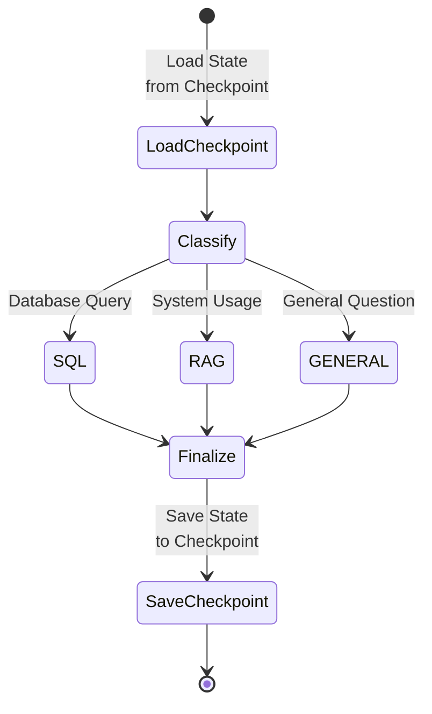

**Responsibilities**:
- Classifies user questions (SQL vs RAG vs GENERAL)
- Routes to SQL Agent, RAG Agent, or General Agent
- Formats final answers
- Manages conversation state with LangGraph checkpointing
- Maintains conversation memory across multiple messages

**Memory Implementation**:
- Uses `AsyncSqliteSaver` for async checkpoint persistence
- Manually loads checkpoint messages before workflow execution
- Merges checkpoint history with new message to preserve context
- Truncates messages before LLM calls to respect token limits
- Singleton agent instance reuses compiled workflow with checkpointer

**State Schema**:
```python
class AgentState(TypedDict):
    messages: Sequence[BaseMessage]  # Conversation history (persisted via checkpointing)
    question: str                     # User question
    next_step: str                    # Routing decision
    sql_result: str | None            # SQL agent output
    sql_structured_result: List[Dict[str, Any]] | None  # Structured data from SQL
    rag_result: str | None            # RAG agent output
    general_result: str | None        # General agent output
    final_answer: str | None          # Final response
    final_structured_data: List[Dict[str, Any]] | None  # Structured data for BFF
```

### 2. SQL Graph Agent

Advanced SQL agent that uses graph algorithms to discover optimal join paths.

**Location**: `src/agents/sql_graph_agent.py`

**Workflow**:
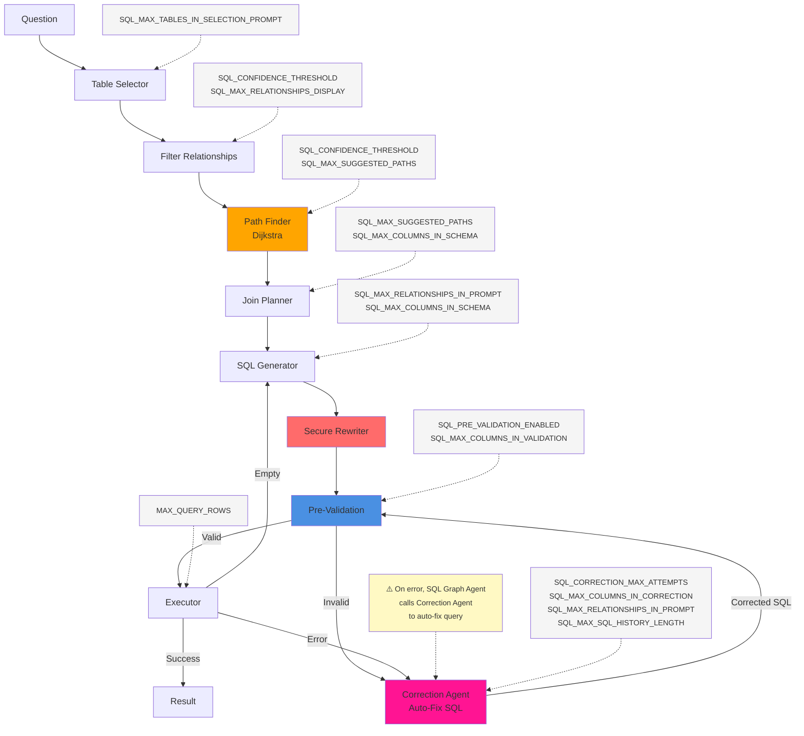

**Key Features**:
- **Table Selection**: LLM selects 3-8 relevant tables from 122 available
- **Path Finding**: Uses Dijkstra's algorithm to find shortest join paths
- **Join Planning**: Discovers transitive paths (multi-hop joins)
- **Secure Views**: Automatic rewriting of encrypted tables
- **Pre-Validation**: Pre-execution column/join validation prevents errors
- **Error Correction**: Iterative SQL correction agent with focused context
- **Re-Validation**: Corrected SQL automatically re-validated before execution

**State Schema**:
```python
class SQLGraphState(TypedDict):
    question: str
    tables: List[str]
    allowed_relationships: List[Dict]
    join_plan: str
    sql: str
    result: Optional[str]
    column_names: Optional[List[str]]
    retries: int
    final_answer: Optional[str]
    structured_result: Optional[List[Dict]]
    sql_correction_attempts: int
    last_sql_error: Optional[str]
    correction_history: Optional[List[Dict]]
    validation_errors: Optional[List[str]]
```

### 3. RAG Agent

Retrieval-Augmented Generation agent for policy and compliance questions.

**Location**: `src/agents/rag_agent.py`

**Workflow**:
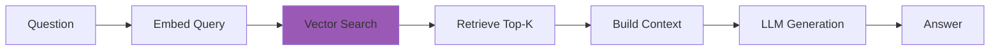

**Data Sources**:
- User manual (core.md, customers.md, work-orders.md)
- System usage documentation
- Feature guides and workflows

### 4. General Agent

Direct LLM agent for general questions that don't require database or document access.

**Location**: `src/agents/orchestrator_agent.py` (implemented as `_execute_general_agent`)

**Workflow**:
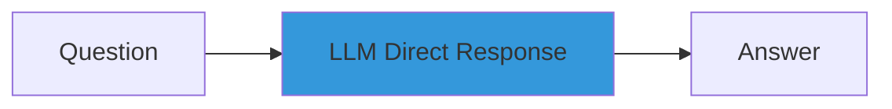

**Use Cases**:
- General knowledge questions
- Explanations of concepts
- Questions not related to business data or policies
- General advice or information

**Examples**:
- "What is machine learning?"
- "Explain quantum computing"
- "What's the weather today?"
- "How does Python work?"

**Characteristics**:
- No database access required
- No document retrieval required
- Direct LLM response
- Fast response time (no complex processing)

## Join Graph Pipeline

The system uses a sophisticated join graph to understand relationships between 122 tables.

### Pipeline Overview

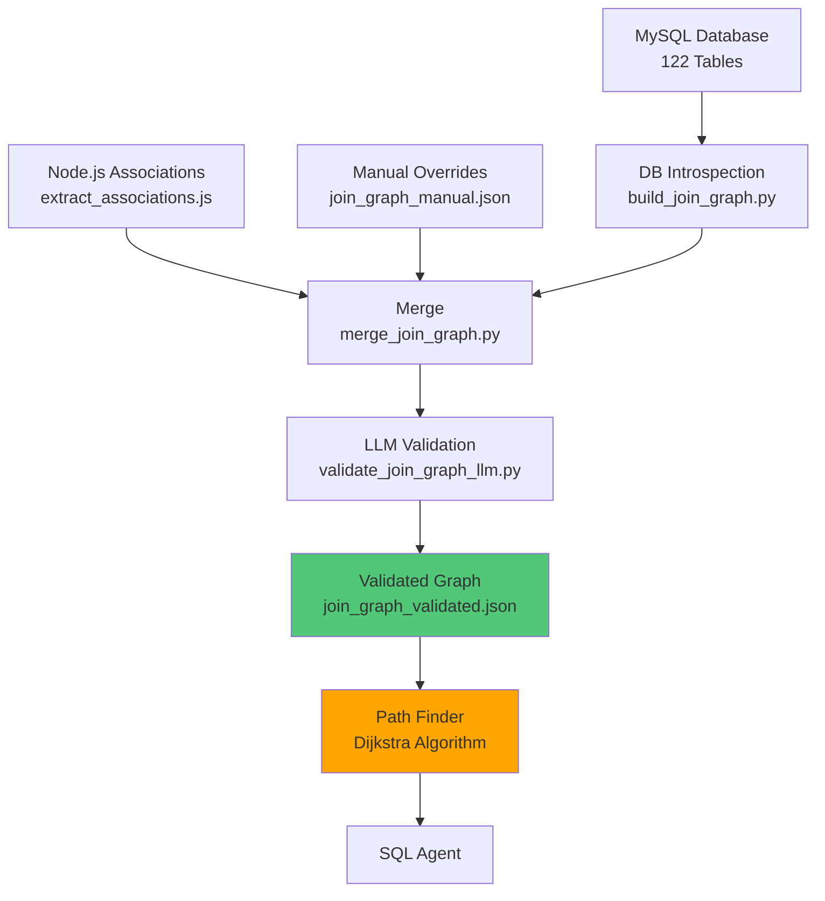

### Graph Structure

```json
{
  "version": 1,
  "tables": {
    "employee": {
      "columns": ["id", "firstName", "lastName", ...],
      "unique_columns": ["id"]
    },
    ...
  },
  "relationships": [
    {
      "from_table": "workTime",
      "from_column": "employeeId",
      "to_table": "employee",
      "to_column": "id",
      "type": "foreign_key",
      "confidence": 1.0,
      "cardinality": "N:1"
    },
    ...
  ]
}
```

### Path Finder

**Location**: `src/utils/path_finder.py`

Uses Dijkstra's algorithm to find shortest join paths between tables:

```python
path_finder = JoinPathFinder(relationships, confidence_threshold=0.7)
path = path_finder.find_shortest_path("employee", "customer", max_hops=4)
# Returns: [rel1, rel2, rel3] - shortest path
```

**Performance**:
- **Before**: Exponential complexity (never finished)
- **After**: O((V + E) log V) - < 100ms per query
- **Caching**: O(1) for repeated paths

## SQL Error Correction System

The system includes a robust error correction mechanism that handles SQL generation errors through pre-validation and iterative correction.

### Correction Flow

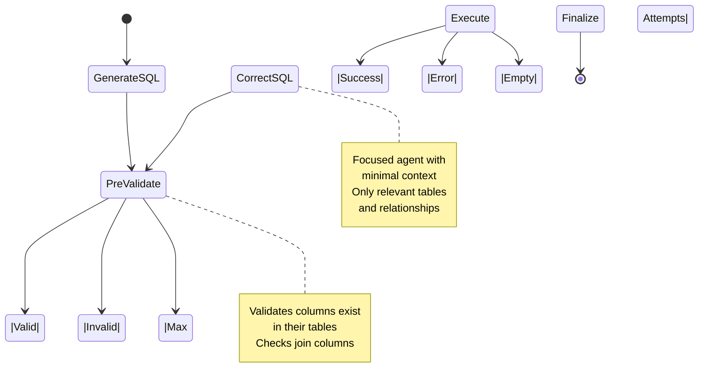

### Pre-Execution Validation

**Purpose**: Catch column and join errors before database execution.

**Checks**:
- Column names exist in their respective tables
- `table.column` references are valid
- Join columns exist in the tables being joined

**Implementation**:
- Extracts all `table.column` references using regex
- Validates against join graph schemas
- Provides specific error messages with suggestions

**Example Error**:
```
Column 'crew.isLead' does NOT exist in table 'crew'. 
Found in: employeeCrew. 
Available columns in crew: id, workOrderId, createdBy, ...
```

### Correction Agent

**Purpose**: Focused agent that fixes SQL errors with minimal context.

**Input Context** (minimal, focused):
- Original question
- Failed SQL query
- Specific error message
- Relevant table schemas (only tables used in query)
- Relevant relationships (only relationships between used tables)
- Correction history (previous attempts)

**Iteration Logic**:
- Tracks attempts in `sql_correction_attempts`
- Max attempts: 3 (configurable via `sql_correction_max_attempts`)
- Each attempt includes previous error and correction history
- If max attempts reached, returns error to main flow

**Correction Patterns Handled**:
1. **Wrong Column in Table**: `crew.isLead` → `employeeCrew.isLead`
2. **Wrong Column Name**: `inspectionQuestion.inspectionId` → correct column
3. **Wrong Join Direction**: Reverses join or uses different join columns

### Re-Validation Loop

After correction, SQL automatically goes through validation again:
1. Correction agent fixes SQL
2. Corrected SQL routed back to pre-validation
3. If valid → execute
4. If invalid → correct again (if attempts < max)
5. Prevents infinite loops with attempt tracking

### Configuration

**Location**: `src/utils/config.py`

```python
sql_correction_max_attempts: int = 3  # Max correction attempts
sql_pre_validation_enabled: bool = True  # Enable pre-execution validation
```

### Benefits

1. **Pre-validation catches errors early** - No database round-trip for obvious errors
2. **Focused correction agent** - Smaller context, faster, more reliable
3. **Iterative improvement** - Each attempt learns from previous errors
4. **Maintains main flow** - Correction is transparent to orchestrator

## Secure Views Architecture

Prevents LLM hallucination of non-existent `secure_*` tables through explicit mapping.

### Three-Layer Architecture

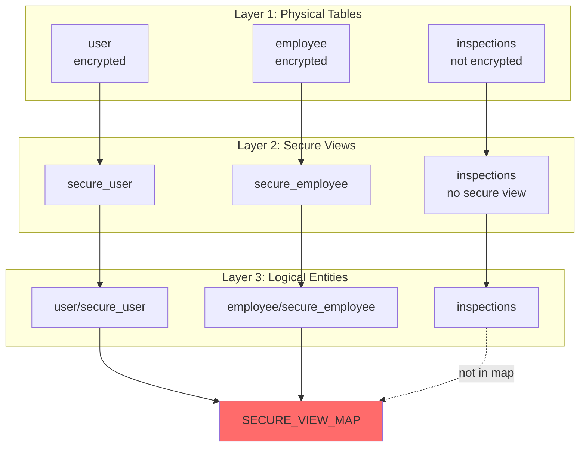

### Secure View Map

**Location**: `src/sql/secure_views.py`

```python
SECURE_VIEW_MAP = {
    "user": "secure_user",
    "employee": "secure_employee",
    "workOrder": "secure_workorder",
    "customer": "secure_customer",
    "customerLocation": "secure_customerlocation",
    "customerContact": "secure_customercontact",
}
```

**Key Rules**:
1. Only tables in `SECURE_VIEW_MAP` get `secure_*` variants
2. LLM uses logical names (e.g., `employee`)
3. System rewrites deterministically (`employee` → `secure_employee`)
4. Validation prevents hallucinations before execution

### Rewriting Flow

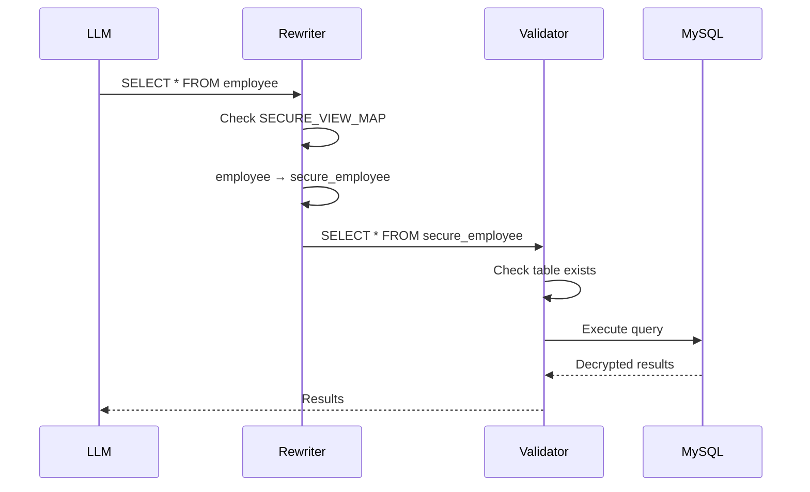

## Data Flow

### SQL Query Flow

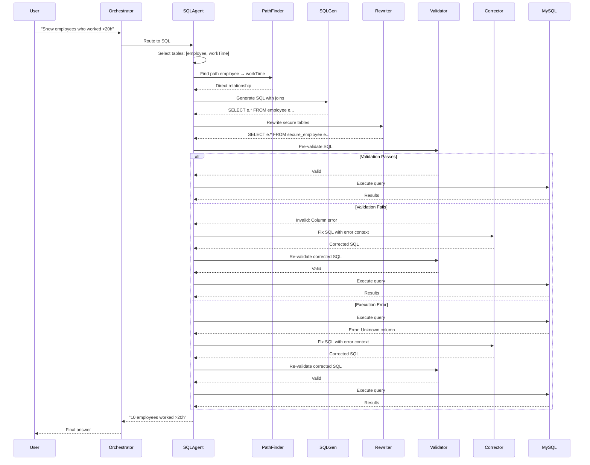

### RAG Query Flow

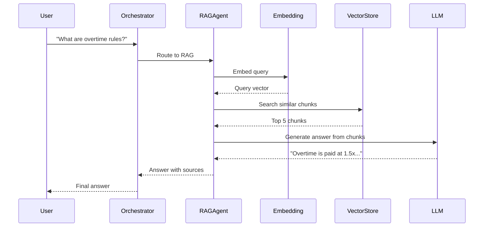

### General Query Flow

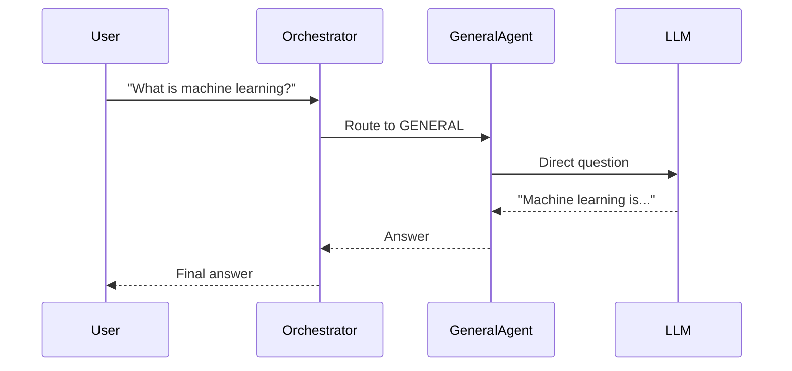

## Configuration

### Environment Variables

All configuration is managed through environment variables loaded from `.env` file.

**Location**: `.env.example` (template), `.env` (actual)

#### Database Configuration

```bash
DB_HOST=127.0.0.1
DB_PORT=3306
DB_USER=root
DB_PWD=
DB_NAME=crewos
DB_ENCRYPT_KEY=your_encryption_key_here
```

#### OpenAI Configuration

```bash
OPENAI_API_KEY=your_openai_api_key_here
OPENAI_MODEL=gpt-4o-mini
OPENAI_TEMPERATURE=0.1
```

#### SQL Agent Core Settings

```bash
# Core behavior
SQL_AGENT_MAX_ITERATIONS=15          # Max workflow iterations
SQL_SAMPLE_ROWS=1                    # Sample rows per table for schema
SQL_MAX_TABLES_IN_CONTEXT=20         # Max tables to include in prompts
SQL_CORRECTION_MAX_ATTEMPTS=3        # Max SQL correction retries
SQL_PRE_VALIDATION_ENABLED=true      # Enable pre-execution validation
```

#### SQL Agent Prompt Limits

These settings control token usage and context size in prompts:

```bash
# Relationship limits
SQL_MAX_RELATIONSHIPS_DISPLAY=50     # Max relationships for initial display
SQL_MAX_RELATIONSHIPS_IN_PROMPT=20   # Max relationships in SQL generation/correction prompts

# Column limits
SQL_MAX_COLUMNS_IN_SCHEMA=50         # Max columns in table schemas (join planning)
SQL_MAX_COLUMNS_IN_VALIDATION=100   # Max columns in validation error messages
SQL_MAX_COLUMNS_IN_CORRECTION=100   # Max columns in correction agent schemas

# Other limits
SQL_MAX_SQL_HISTORY_LENGTH=100      # Max SQL length in correction history
SQL_MAX_FALLBACK_TABLES=5           # Max tables in fallback selection
SQL_MAX_TABLES_IN_SELECTION_PROMPT=250  # Max tables shown in table selection prompt
```

**Purpose**: Prevent prompt bloat while ensuring sufficient context for accurate SQL generation. Adjust based on:
- Available token budget
- Database complexity (number of tables/columns)
- Model context window size

#### Token Limits

```bash
MAX_CONTEXT_TOKENS=120000           # Max input tokens
MAX_OUTPUT_TOKENS=4000              # Max output tokens
MAX_QUERY_ROWS=100                  # Max rows returned from queries
```

### Configuration Loading

**Location**: `src/utils/config.py`

Configuration is loaded using Pydantic `BaseSettings`, which automatically:
- Reads from `.env` file
- Reads from environment variables
- Provides type validation
- Sets sensible defaults

**Usage**:
```python
from src.utils.config import settings

# Access configuration
max_tables = settings.sql_max_tables_in_context
max_columns = settings.sql_max_columns_in_schema
```

## Database Configuration

### MySQL Connection

**Location**: `src/models/database.py`

**Connection String**:
```python
mysql+pymysql://{user}:{password}@{host}:{port}/{database}
```

**Connection Pooling**:
- Pool size: 5
- Max overflow: 10
- Pool recycle: 3600 seconds
- Pool pre-ping: Enabled

### Session Variables

MySQL session variables are set automatically on connection:

```python
SET @aesKey = '{encryption_key}'
SET @customerIds = NULL
SET @workOrderIds = NULL
SET @serviceLocationIds = NULL
```

**Purpose**: Enable secure views to decrypt encrypted fields using `AES_DECRYPT()`.

## Security Architecture

### Secure Views Access Control

1. **Base tables excluded**: Encrypted base tables are hidden from SQL agent
2. **Secure views exposed**: Only secure views are visible in schema
3. **Automatic rewriting**: System rewrites queries to use secure views
4. **Validation**: All table references validated before execution

### Encryption Flow

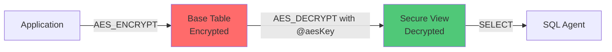

## Performance Characteristics

### SQL Agent Performance

| Operation | Time | Notes |
|-----------|------|-------|
| Table Selection | 1-2s | LLM call |
| Path Finding | <100ms | Dijkstra algorithm |
| SQL Generation | 1-2s | LLM call |
| Pre-Validation | <50ms | Column/join checks |
| SQL Correction | 1-2s | LLM call (if needed) |
| Query Execution | 0.5-5s | Depends on query |
| **Total** | **3-10s** | End-to-end (no errors) |
| **With Correction** | **5-15s** | 1-3 correction attempts |

### RAG Agent Performance

| Operation | Time | Notes |
|-----------|------|-------|
| Query Embedding | <100ms | Cached: <1ms |
| Vector Search | 10-50ms | ChromaDB |
| LLM Generation | 1-3s | Depends on context |
| **Total** | **1-4s** | End-to-end |

### General Agent Performance

| Operation | Time | Notes |
|-----------|------|-------|
| LLM Generation | 1-3s | Direct response, no retrieval |
| **Total** | **1-3s** | End-to-end (fastest route) |

### Caching Strategy

- **Embeddings**: Disk cache (`data/embeddings_cache/`)
- **Path Finder**: In-memory cache (per session)
- **Join Graph**: Loaded once at startup

## Scalability Considerations

### Current Limits

- **Tables**: 122 (tested)
- **Relationships**: 1,801
- **Max Hops**: 4 (configurable)
- **Context Window**: 128K tokens (gpt-4o-mini)

### Optimization Strategies

1. **Table Selection**: Limit to 3-8 tables per query
2. **Schema Sampling**: Reduce sample rows (currently 1-3)
3. **Path Caching**: Cache computed paths
4. **Query Limits**: Always use LIMIT clauses

## Technology Stack

| Component | Technology | Purpose |
|-----------|-----------|---------|
| **LLM** | OpenAI GPT-4o-mini | Natural language understanding |
| **Workflow** | LangGraph | Agent orchestration |
| **Database** | MySQL + SQLAlchemy | Data storage |
| **Vector DB** | ChromaDB | Document embeddings |
| **API** | FastAPI | Internal service |
| **Streaming** | Server-Sent Events | Real-time responses |
| **Path Finding** | Dijkstra Algorithm | Join path discovery |

## Key Design Decisions

### 1. Graph-Based Join Discovery

**Why**: Traditional SQL agents struggle with 100+ tables. Graph algorithms find optimal paths efficiently.

**How**: Dijkstra's algorithm finds shortest paths between selected tables.

**Benefit**: Discovers multi-hop joins automatically.

### 2. Secure Views Pattern

**Why**: Prevents LLM from hallucinating non-existent `secure_*` tables.

**How**: Explicit mapping + deterministic rewriting + validation.

**Benefit**: Zero hallucination errors, fail-fast validation.

### 3. Internal API Pattern

**Why**: Separates AI logic from frontend concerns.

**How**: BFF pattern - Node.js handles auth/UX, Python handles agents.

**Benefit**: Clean separation, reusable, secure.

### 4. On-Demand Path Finding

**Why**: Precomputing all paths is exponential.

**How**: Compute paths only for selected tables using Dijkstra.

**Benefit**: Efficient, scalable, cached.

### 5. Hybrid Error Correction System

**Why**: LLMs sometimes generate SQL with wrong columns or joins, causing execution failures.

**How**: Pre-execution validation + focused correction agent with iterative retry.

**Benefit**: Self-healing SQL generation, reduces manual intervention, improves reliability.

## Conversation Memory

The system uses LangGraph's native SQLite checkpointing to maintain conversation context across multiple messages. This enables the agent to remember previous questions and answers, making conversations feel natural and contextual.

### Architecture

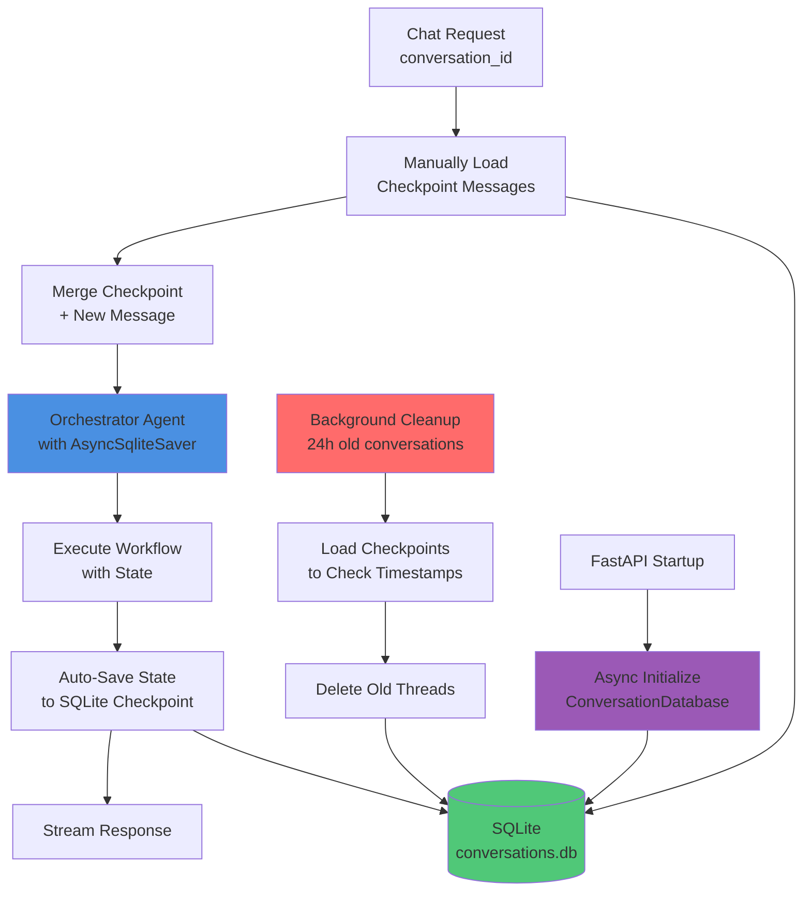

### Implementation Details

**Location**: `src/models/conversation_db.py` and `src/api/routes/chat.py`

**Key Components**:

1. **ConversationDatabase**: Abstraction layer for conversation storage
   - **Async Initialization**: Uses `AsyncSqliteSaver` with `aiosqlite` for async operations
   - Initializes SQLite connection with WAL mode for concurrency
   - Creates `AsyncSqliteSaver` instance directly with connection (not context manager)
   - Provides checkpointer instance for LangGraph workflow compilation
   - Handles message truncation and memory management
   - Manages cleanup of old conversations by loading checkpoints to check timestamps
   - Singleton pattern: Single instance shared across all requests

2. **Checkpointing**: LangGraph's native state persistence
   - Uses `thread_id` (mapped from `conversation_id`) to isolate conversations
   - **Manual State Loading**: Before workflow execution, checkpoint messages are manually loaded using `aget_tuple()`
   - **State Merging**: Checkpoint messages are merged with the new user message before creating `initial_state`
   - This prevents `initial_state` from overriding checkpoint state (LangGraph's default behavior)
   - Automatically saves state after each workflow node execution
   - Uses async checkpoint API (`aget_tuple`, `aput`) for non-blocking operations

3. **Message Truncation**: Respects token limits
   - Configurable via `MAX_CONVERSATION_MESSAGES` (default: 20)
   - Keeps most recent messages (last N)
   - Applied before each LLM call (`_classify_question`, `_execute_general_agent`, etc.)
   - Truncation happens in memory, not in database (preserves full history)

4. **Cleanup**: Automatic removal of old conversations
   - Runs periodically (configurable interval, default: 1 hour)
   - Loads each thread's latest checkpoint to extract timestamp from checkpoint BLOB
   - Deletes conversations older than 24 hours (configurable) using `adelete_thread()`
   - Background task runs during FastAPI lifespan (startup/shutdown)
   - Initial cleanup runs on application startup

### State Management

**AgentState Schema**:
```python
class AgentState(TypedDict):
    messages: Sequence[BaseMessage]  # Conversation history (persisted)
    question: str                    # Current question
    next_step: str                   # Routing decision
    sql_result: str | None
    rag_result: str | None
    general_result: str | None
    final_answer: str | None
    # ... other fields
```

**Checkpoint Behavior**:
- **Manual Loading**: Before workflow execution, checkpoint messages are manually loaded using `checkpointer.aget_tuple(config)`
- **State Merging**: Checkpoint messages are explicitly merged with new message: `all_messages = checkpoint_messages + [HumanMessage(content=new_message)]`
- **Initial State**: Merged messages are passed as `initial_state["messages"]` to prevent LangGraph from overriding checkpoint state
- **Automatic Saving**: LangGraph automatically saves state after each node execution
- **Thread Isolation**: Each `conversation_id` maps to a unique `thread_id` for complete isolation

### Configuration

**Environment Variables**:
```bash
CONVERSATION_DB_PATH=data/conversations.db          # SQLite database path (resolved to absolute)
CONVERSATION_MAX_AGE_HOURS=24                        # Delete conversations older than this
CONVERSATION_CLEANUP_INTERVAL_HOURS=1               # How often to run cleanup task
MAX_CONVERSATION_MESSAGES=20                         # Max messages to keep in context
CONVERSATION_MEMORY_STRATEGY=simple                 # Memory strategy (simple/tiered)
CONVERSATION_DB_RETRY_ATTEMPTS=3                    # Retry attempts for locked DB
CONVERSATION_DB_RETRY_DELAY=0.1                     # Initial retry delay (seconds)
```

**Dependencies**:
- `langgraph-checkpoint-sqlite>=1.0.0`: LangGraph SQLite checkpointing
- `aiosqlite>=0.20.0`: Async SQLite support for `AsyncSqliteSaver`

### Error Handling

- **Database locked**: Retry with exponential backoff (up to `CONVERSATION_DB_RETRY_ATTEMPTS`)
- **Checkpoint loading failure**: Log warning, start fresh conversation (no previous context)
- **Checkpoint saving failure**: Fallback to stateless mode (request succeeds, but no memory saved)
- **Corrupt checkpoint**: Log error, start fresh conversation
- **Missing thread_id**: Create new checkpoint (first message in conversation)
- **Async initialization failure**: Application startup fails (critical error)
- **Cleanup failure**: Log error, continue operation (non-critical)

### Concurrency & Performance

- **WAL mode**: SQLite Write-Ahead Logging enables concurrent reads
- **Async operations**: Uses `AsyncSqliteSaver` with `aiosqlite` for non-blocking I/O
- **Singleton pattern**: 
  - `ConversationDatabase`: Single instance initialized at FastAPI startup
  - `OrchestratorAgent`: Single instance reused across all requests (compiled workflow with checkpointer)
- **Connection Management**: Single persistent `aiosqlite.Connection` kept open for the application lifetime
- **Timeout**: 5 second wait for database locks (`PRAGMA busy_timeout=5000`)
- **Error Handling**: Retry logic for "database locked" errors with exponential backoff
- **Fallback**: If checkpointing fails, falls back to stateless mode (no memory, but request succeeds)

### Future Extensions

**Tiered Memory** (designed but not implemented):
- Short-term: Last 10 messages (full detail)
- Medium-term: Messages 10-50 (summarized)
- Long-term: Full conversation summary

**Migration Path**:
- Abstraction layer (`ConversationDatabase`) allows swapping SQLite → MySQL/Redis
- Checkpointer interface is standardized (LangGraph's `BaseCheckpointSaver`)
- Easy to extend with entity memory, user preferences
- Supports conversation branching and time-travel debugging
- Current implementation uses direct connection (not context manager) for persistent use

**Implementation Notes**:
- `AsyncSqliteSaver` is instantiated directly with `aiosqlite.Connection` (not via `from_conn_string()` context manager)
- Connection is kept open for application lifetime and closed on shutdown
- Checkpoint timestamps are stored in checkpoint BLOB (not as separate column), requiring checkpoint loading for cleanup
- Singleton pattern ensures single agent instance with compiled workflow (performance optimization)

## Future Enhancements

1. **Tiered Memory**: Implement summarization for long conversations
2. **Query Optimization**: Cost-based query plan analysis
3. **Semantic Table Selection**: Use embeddings to find relevant tables
4. **Multi-Tenancy**: Company-specific data isolation
5. **Monitoring**: LangSmith integration, metrics, tracing
6. **Entity Memory**: Remember mentioned technicians, jobs, dates across conversations
