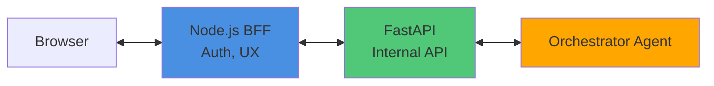
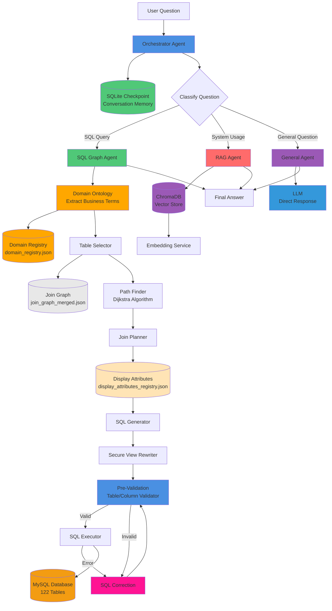
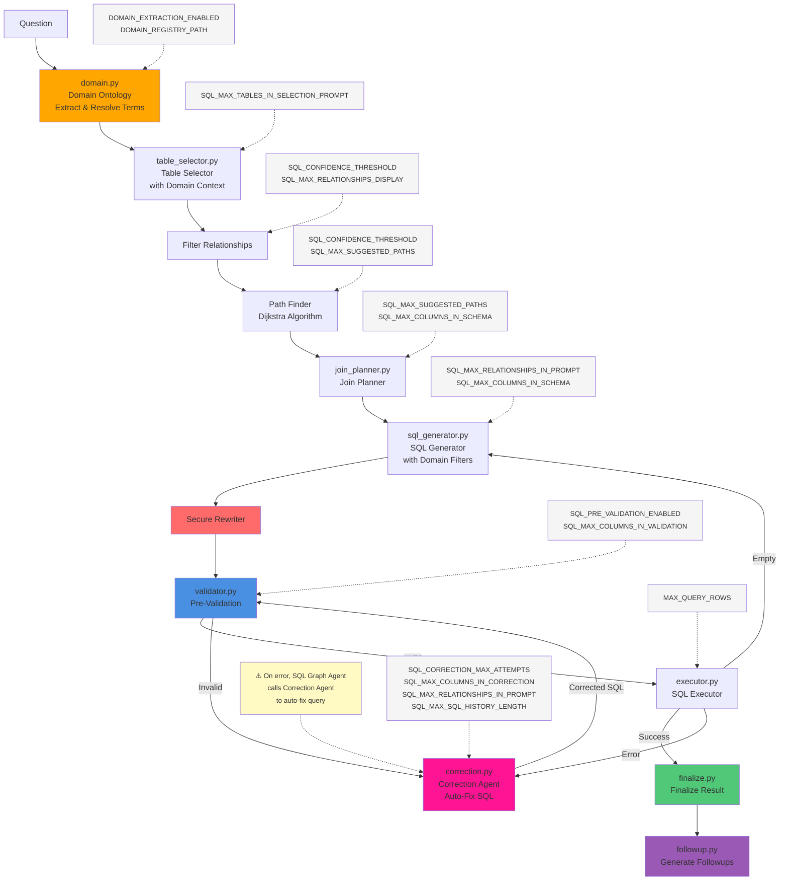
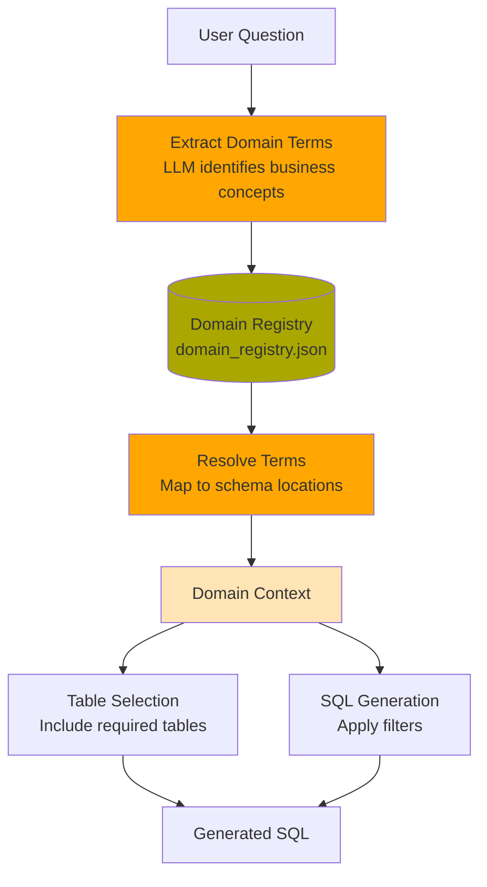
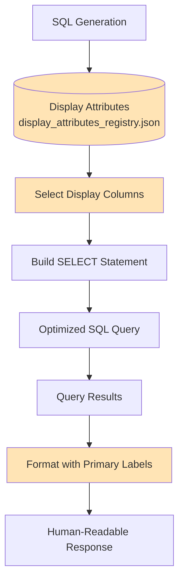
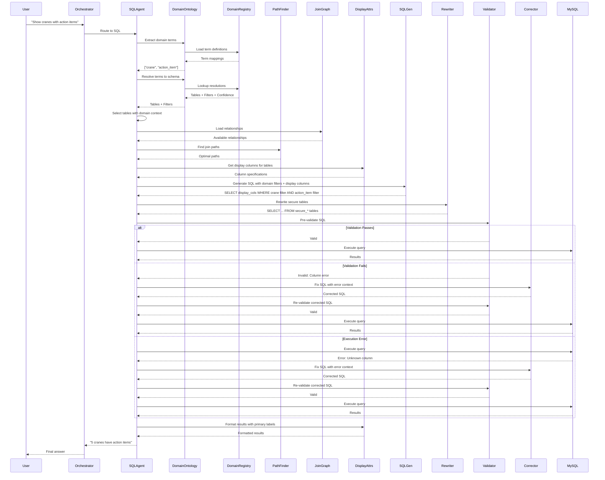

# System Architecture

## Overview

This document describes the architecture of the Advanced AI Agent system - an intelligent SQL agent that works with MySQL databases containing 100+ tables. The system uses LangGraph workflows, graph algorithms for join path discovery, and secure views for encrypted data access.

## API Architecture

### Internal API Service

The system exposes a FastAPI internal service following the Backend-for-Frontend (BFF) pattern. The Node.js BFF sends the user message to the internal API; the Orchestrator Agent processes it and **streams** the response back (Server-Sent Events) through the same path.

**Location**: `src/api/`

**Architecture** (request → Orchestrator; response stream ← Orchestrator):


**Flow**: Request flows Browser → Node.js → FastAPI → Orchestrator. The response is **streamed** back (SSE) in the reverse direction: Orchestrator → FastAPI → Node.js → Browser, so the client receives tokens and events as they are produced.

### Endpoint

**POST** `/internal/chat/stream`

**Request**:
```json
{
  "input": {
    "message": "How many technicians are active?"
  },
  "conversation": {
    "id": "conv-uuid-123",
    "user_id": "user-456",
    "company_id": "company-789"
  }
}
```

**Response** (Server-Sent Events):
```
data: {"event":"route_decision","route":"sql"}

data: {"event":"tool_start","tool":"sql_agent"}

data: {"event":"token","channel":"final","content":"There"}

data: {"event":"token","channel":"final","content":" are 10"}

data: {"event":"complete","stats":{"tokens":15}}
```

### Event Types

| Event | Description |
|-------|-------------|
| `route_decision` | Agent routing decision (SQL/RAG/GENERAL) |
| `tool_start` | Tool execution beginning |
| `token` | Content token with channel |
| `complete` | Stream finished |
| `error` | Error occurred |

## System Components



## Core Agents

### 1. Orchestrator Agent

The main entry point that routes questions to appropriate agents. Maintains conversation memory using LangGraph checkpointing.

**Location**: `src/agents/orchestrator/agent.py`

**Workflow**:


**Responsibilities**:
- Classifies user questions (SQL vs RAG vs GENERAL)
- Routes to SQL Agent, RAG Agent, or General Agent
- Formats final answers
- Manages conversation state with LangGraph checkpointing
- Maintains conversation memory across multiple messages

**Memory Implementation**:
- Uses `AsyncSqliteSaver` for async checkpoint persistence
- Manually loads checkpoint messages before workflow execution
- Merges checkpoint history with new message to preserve context
- Truncates messages before LLM calls to respect token limits
- Singleton agent instance reuses compiled workflow with checkpointer

**State Schema**:
```python
class AgentState(TypedDict):
    messages: Sequence[BaseMessage]  # Conversation history (persisted via checkpointing)
    question: str                     # User question
    next_step: str                    # Routing decision
    sql_result: str | None            # SQL agent output
    sql_structured_result: List[Dict[str, Any]] | None  # Structured data from SQL
    rag_result: str | None            # RAG agent output
    general_result: str | None        # General agent output
    final_answer: str | None          # Final response
    final_structured_data: List[Dict[str, Any]] | None  # Structured data for BFF
```

### 2. SQL Graph Agent

Advanced SQL agent that uses graph algorithms to discover optimal join paths.

**Location**: `src/agents/sql/agent.py`

**Workflow** (Node Implementation):

Each workflow step is implemented as a separate node in `src/agents/sql/nodes/`:



**Key Features**:
- **Table Selection**: LLM selects 3-8 relevant tables from 122 available
- **Path Finding**: Uses Dijkstra's algorithm to find shortest join paths
- **Join Planning**: Discovers transitive paths (multi-hop joins)
- **Secure Views**: Automatic rewriting of encrypted tables
- **Pre-Validation**: Pre-execution column/join validation prevents errors
- **Error Correction**: Iterative SQL correction agent with focused context
- **Re-Validation**: Corrected SQL automatically re-validated before execution

**State Schema**:
```python
class SQLGraphState(TypedDict):
    question: str
    tables: List[str]
    allowed_relationships: List[Dict]
    join_plan: str
    sql: str
    result: Optional[str]
    column_names: Optional[List[str]]
    retries: int
    final_answer: Optional[str]
    structured_result: Optional[List[Dict]]
    sql_correction_attempts: int
    last_sql_error: Optional[str]
    correction_history: Optional[List[Dict]]
    validation_errors: Optional[List[str]]
```

### Domain Ontology System

The Domain Ontology system bridges the gap between business terminology and database schema, enabling natural language queries to be accurately mapped to SQL constructs.

**Location**: 
- `src/domain/ontology/`
  - `extractor.py` - Term extraction from questions
  - `resolver.py` - Term resolution to schema
  - `formatter.py` - Context formatting for prompts
  - `models.py` - Domain models and types
- `artifacts/domain_registry.json` (registry file)

**Purpose**: Maps business concepts (like "crane", "action item", "inspection questions") to specific database tables, columns, and filter conditions.

#### Architecture



#### Domain Registry Structure

The domain registry (`artifacts/domain_registry.json`) contains mappings for business terms:

```json
{
  "version": 1,
  "terms": {
    "crane": {
      "entity": "asset",
      "description": "Heavy lifting equipment",
      "resolution": {
        "primary": {
          "table": "asset",
          "columns": ["name", "manufacturer", "modelNumber"],
          "match_type": "text_search",
          "confidence": 0.95
        },
        "secondary": {
          "table": "assetType",
          "column": "name",
          "match_type": "text_search",
          "confidence": 0.5
        }
      }
    },
    "action_item": {
      "entity": "inspection_finding",
      "resolution": {
        "primary": {
          "table": "inspectionQuestionAnswer",
          "column": "isActionItem",
          "match_type": "boolean",
          "value": true,
          "confidence": 1.0
        }
      }
    },
    "inspection_questions": {
      "entity": "inspection_detail",
      "resolution": {
        "primary": {
          "tables": ["inspectionQuestion", "inspectionQuestionAnswer"],
          "match_type": "structural",
          "confidence": 0.95
        }
      }
    }
  }
}
```

#### Resolution Strategies

The system supports multiple resolution strategies with fallback mechanisms:

1. **Primary Resolution** (highest confidence)
   - Direct table/column mapping
   - Used first when resolving terms

2. **Secondary Resolution** (medium confidence)
   - Alternative schema locations
   - Used if primary resolution doesn't fit context

3. **Fallback Resolution** (lowest confidence)
   - Generic search across related tables
   - Last resort for ambiguous terms

#### Match Types

Different match types handle various query patterns:

**Text Search** (`text_search`, `semantic`):
- Searches text columns using case-insensitive LIKE
- Example: "crane" → `LOWER(asset.name) LIKE '%crane%'`
- Supports multiple columns (OR'd together)

**Boolean Filter** (`boolean`):
- Exact boolean column matches
- Example: "action item" → `inspectionQuestionAnswer.isActionItem = true`

**Structural Grouping** (`structural`):
- Groups related tables together without filters
- Example: "inspection questions" → includes both `inspectionQuestion` and `inspectionQuestionAnswer`
- Used for parent-child table relationships

**Exact Match** (`exact`):
- Exact value matching
- Example: specific status codes or enum values

#### Workflow Integration

**Step 1: Term Extraction**
```python
# LLM extracts business terms from question
question = "Find cranes with action items"
terms = ontology.extract_domain_terms(question)
# Returns: ["crane", "action_item"]
```

**Step 2: Term Resolution**
```python
# Resolve each term to schema locations
resolutions = []
for term in terms:
    resolution = ontology.resolve_domain_term(term)
    resolutions.append(resolution)

# Returns:
# [
#   DomainResolution(
#     term="crane",
#     tables=["asset", "assetType"],
#     filters=[{"table": "asset", "column": "name", "operator": "LIKE", ...}],
#     confidence=0.95
#   ),
#   DomainResolution(
#     term="action_item",
#     tables=["inspectionQuestionAnswer"],
#     filters=[{"table": "inspectionQuestionAnswer", "column": "isActionItem", ...}],
#     confidence=1.0
#   )
# ]
```

**Step 3: Table Selection Enhancement**
```python
# Inject domain context into table selection prompt
context = format_domain_context_for_table_selection(resolutions)
# Shows required tables for business concepts
# Helps LLM select correct tables
```

**Step 4: SQL Generation Enhancement**
```python
# Inject domain filters into SQL generation
context = format_domain_context(resolutions)
where_clauses = build_where_clauses(resolutions)

# Generated SQL includes:
# - Proper table joins (from domain.tables)
# - Business logic filters (from domain.filters)
# - Case-insensitive matching where appropriate
```

#### Benefits

1. **Semantic Understanding**: Translates business language to database schema
2. **Consistent Mapping**: Same term always resolves to same schema location
3. **Multi-Strategy Resolution**: Fallback mechanisms handle ambiguity
4. **Case-Insensitive Search**: Handles "Crane", "crane", "CRANE" uniformly
5. **Extensible**: New business terms added via JSON (no code changes)
6. **Confidence Scoring**: Tracks resolution reliability
7. **Structural Awareness**: Understands parent-child table relationships

#### Configuration

**Environment Variables**:
```bash
DOMAIN_REGISTRY_PATH=artifacts/domain_registry.json  # Registry location
DOMAIN_EXTRACTION_ENABLED=true                        # Enable/disable extraction
```

**Location**: `src/utils/config.py`

#### Example Queries

**Query**: "Show me cranes with action items"

**Domain Extraction**:
- Terms: `["crane", "action_item"]`

**Resolution**:
- `crane` → `asset` table, text search on name/manufacturer/model
- `action_item` → `inspectionQuestionAnswer.isActionItem = true`

**Generated SQL**:
```sql
SELECT a.*, iqa.*
FROM asset a
JOIN inspection i ON i.assetId = a.id
JOIN inspectionQuestionAnswer iqa ON iqa.inspectionId = i.id
WHERE LOWER(a.name) LIKE '%crane%'
  AND iqa.isActionItem = true
```

**Query**: "Find inspection questions for forklifts"

**Domain Extraction**:
- Terms: `["inspection_questions", "forklift"]`

**Resolution**:
- `inspection_questions` → structural grouping of `inspectionQuestion` + `inspectionQuestionAnswer`
- `forklift` → `asset` table, text search

**Generated SQL**:
```sql
SELECT iq.*, iqa.*, a.name
FROM inspectionQuestion iq
JOIN inspectionQuestionAnswer iqa ON iqa.questionId = iq.id
JOIN inspection i ON i.id = iq.inspectionId
JOIN asset a ON a.id = i.assetId
WHERE LOWER(a.name) LIKE '%forklift%'
```

#### Future Enhancements

1. **Synonym Detection**: Automatically detect synonyms (e.g., "corrective action" = "action item")
2. **Unresolved Term Logging**: Track terms users mention but aren't in registry
3. **Dynamic Registry Updates**: Admin UI to add new terms without redeployment
4. **Context-Aware Resolution**: Choose resolution strategy based on query context
5. **Embedding-Based Matching**: Use semantic similarity for fuzzy term matching

### Display Attributes System

The Display Attributes system optimizes SQL queries by defining which columns to retrieve and how to present them to users.

**Location**: `src/domain/display_attributes/`, `artifacts/display_attributes_registry.json`

**Purpose**: Reduces token usage and improves clarity by selecting only relevant columns for display.

#### Architecture



#### Registry Structure

The display attributes registry (`artifacts/display_attributes_registry.json`) defines:

```json
{
  "version": 1,
  "description": "Display attributes for tables",
  "tables": {
    "asset": {
      "display_columns": ["id", "name", "modelNumber", "serialNumber"],
      "primary_label": ["name"]
    },
    "employee": {
      "display_columns": ["id", "firstName", "lastName", "email"],
      "primary_label": ["firstName", "lastName"]
    },
    "workOrder": {
      "display_columns": ["id", "title", "status", "customerId"],
      "primary_label": ["title"]
    }
  }
}
```

#### Field Definitions

**Display Columns**:
- Columns to retrieve in SQL `SELECT` statements
- Typically 3-5 most relevant columns per table
- Reduces token usage by excluding verbose/unnecessary columns
- Improves query performance

**Primary Label**:
- Columns that form a human-readable identifier
- Used for presenting results to users
- Example: "John Doe" instead of employee ID "12345"
- Can be multiple columns (e.g., firstName + lastName)

#### Integration with SQL Agent

**Step 1: Table Selection**
- Agent selects relevant tables (e.g., `asset`, `inspection`)

**Step 2: Column Selection (with Display Attributes)**
```python
# Without display attributes
SELECT asset.*, inspection.*  # 50+ columns

# With display attributes
SELECT 
  asset.id, asset.name, asset.modelNumber, asset.serialNumber,
  inspection.id, inspection.date, inspection.result
```

**Step 3: Result Formatting**
```python
# Results use primary_label for readability
{
  "asset": "Crane #42",  # Uses asset.name (primary_label)
  "inspector": "John Doe",  # Uses firstName + lastName (primary_label)
  "status": "Passed"
}
```

#### Benefits

1. **Token Reduction**: Fewer columns → smaller prompts and responses
2. **Performance**: Less data transferred from database
3. **Clarity**: Only relevant information shown to users
4. **Consistency**: Standard column sets across all queries for same table
5. **Maintainability**: Centralized column definitions (no hardcoding in prompts)

#### Configuration

**Environment Variables**: None (loaded directly from JSON file)

**Location**: `artifacts/display_attributes_registry.json`

#### Usage Example

**Query**: "Show me all cranes"

**Without Display Attributes**:
```sql
SELECT asset.*  -- Returns 30+ columns including verbose fields
FROM asset
WHERE LOWER(asset.name) LIKE '%crane%'
```

**With Display Attributes**:
```sql
SELECT 
  asset.id,
  asset.name,
  asset.modelNumber,
  asset.serialNumber
FROM asset
WHERE LOWER(asset.name) LIKE '%crane%'
```

**Formatted Response**:
- "Crane #42" (using `name` as primary_label)
- "Model: CAT-320, Serial: ABC123"

#### Future Enhancements

1. **Dynamic Attributes**: Context-aware column selection based on query
2. **User Preferences**: Allow users to customize display columns
3. **Computed Columns**: Support for derived/calculated display fields
4. **Nested Labels**: Support for related table labels (e.g., "Asset: Crane #42, Owner: ACME Corp")
5. **Localization**: Multi-language support for labels

### 3. RAG Agent

Retrieval-Augmented Generation agent for policy and compliance questions.

**Location**: `src/agents/rag/agent.py`

**Workflow**:


**Data Sources**:
- User manual (core.md, customers.md, work-orders.md)
- System usage documentation
- Feature guides and workflows

### 4. General Agent

Direct LLM agent for general questions that don't require database or document access.

**Location**: `src/agents/general/agent.py`

**Workflow**:


**Use Cases**:
- General knowledge questions
- Explanations of concepts
- Questions not related to business data or policies
- General advice or information

**Examples**:
- "What is machine learning?"
- "Explain quantum computing"
- "What's the weather today?"
- "How does Python work?"

**Characteristics**:
- No database access required
- No document retrieval required
- Direct LLM response
- Fast response time (no complex processing)

## Join Graph Pipeline

The system uses a sophisticated join graph to understand relationships between 122 tables.

### Pipeline Overview


### Graph Structure

```json
{
  "version": 1,
  "tables": {
    "employee": {
      "columns": ["id", "firstName", "lastName", ...],
      "unique_columns": ["id"]
    },
    ...
  },
  "relationships": [
    {
      "from_table": "workTime",
      "from_column": "employeeId",
      "to_table": "employee",
      "to_column": "id",
      "type": "foreign_key",
      "confidence": 1.0,
      "cardinality": "N:1"
    },
    ...
  ]
}
```

### Path Finder

**Location**: `src/sql/graph/path_finder.py`

Uses Dijkstra's algorithm to find shortest join paths between tables:

```python
path_finder = JoinPathFinder(relationships, confidence_threshold=0.7)
path = path_finder.find_shortest_path("employee", "customer", max_hops=4)
# Returns: [rel1, rel2, rel3] - shortest path
```

**Performance**:
- **Before**: Exponential complexity (never finished)
- **After**: O((V + E) log V) - < 100ms per query
- **Caching**: O(1) for repeated paths

### Semantic Role System

The join graph includes a **semantic role system** that classifies tables by their business purpose. This prevents the system from adding unnecessary bridge tables when direct foreign key relationships exist.

**Location**: `artifacts/join_graph_manual.json` (table_metadata section)

#### Table Roles

Tables are classified into semantic roles that determine their behavior in bridge table discovery:

| Role | Purpose | Bridge Behavior | Examples |
|------|---------|-----------------|----------|
| **instance** | Primary entity executions | Normal bridge candidate | `inspection`, `safety`, `service`, `workTime` |
| **template** | Structure/schema definitions | Normal bridge candidate | `inspectionTemplate`, `safetyTemplate` |
| **bridge** | Legitimate many-to-many junctions | Used as bridges when needed | `inspectionTemplateWorkOrder`, `serviceTemplateWorkOrder` |
| **content_child** | Child data within parent context | Normal bridge candidate | `inspectionQuestion`, `inspectionQuestionAnswer` |
| **satellite** | Orthogonal auxiliary data | **NEVER** used as bridge | `inspectionConfiguration`, `inspectionSignature` |
| **assignment** | Membership/assignment tracking | **NEVER** used as bridge | `employeeCrew` (crew assignments) |
| **configuration** | Permission/config settings | **NEVER** used as bridge | `employeeRoleWorkTimeType` (role permissions) |

#### Bridge Table Discovery Logic

The `find_bridge_tables()` function uses a three-layer defense strategy:

**Layer 1: Semantic Role Filtering**
```python
# Exclude satellite, assignment, and configuration tables
if role in ("satellite", "assignment", "configuration"):
    logger.debug(f"Excluding {role} table from bridge discovery")
    return True
```

**Layer 2: Metadata Exclusions**
```json
{
  "employeeCrew": {
    "role": "assignment",
    "exclude_as_bridge_for": ["workTime", "employee"],
    "note": "Only for crew membership, not time tracking"
  }
}
```

**Layer 3: Direct Path Detection**
```python
# Only add bridge if no direct path exists
if all_have_direct_path:
    logger.info("Skipping bridge - direct paths exist")
    continue
```

#### Example: workTime Query

**Problem**: System was adding unnecessary bridge tables

**Before Fix**:
```
Query: "employees with work time between Oct 6-12"
Selected: employee, workTime, workTimeType
Bridges added: employeeCrew ❌, employeeRoleWorkTimeType ❌
Result: 5 tables (incorrect)
```

**After Fix**:
```
Query: "employees with work time between Oct 6-12"
Selected: employee, workTime, workTimeType
Bridges added: None (direct FKs exist)
Result: 3 tables using: workTime.employeeId -> employee.id ✅
```

**Why the fix works**:
1. `employeeCrew` has role="assignment" → excluded from bridge discovery
2. `employeeRoleWorkTimeType` has role="configuration" → excluded from bridge discovery
3. Direct foreign key `workTime.employeeId -> employee.id` exists (confidence=1.0)
4. Bridge table logic detects direct path and skips unnecessary bridges

#### When to Use Each Role

**instance**: Use for tables representing actual executions/records
- ✅ `inspection` (inspection instance)
- ✅ `workTime` (time entry record)
- ✅ `safety` (safety execution)

**satellite**: Use for orthogonal auxiliary data that doesn't affect query logic
- ✅ Signatures (inspectionCustomerSignature)
- ✅ Attachments (inspectionQAAttachment)
- ✅ Configuration (inspectionConfiguration)

**assignment**: Use for membership/assignment tracking tables
- ✅ `employeeCrew` - tracks which employees are on which crews
- ✅ Not needed for: time tracking, inspection queries, direct employee data

**configuration**: Use for permission/settings tables
- ✅ `employeeRoleWorkTimeType` - defines allowed work types per role
- ✅ Not needed for: actual time entries, employee work records

**bridge**: Use for legitimate many-to-many junction tables that ARE needed
- ✅ `inspectionTemplateWorkOrder` - connects inspection instances to work orders
- ✅ Required when: querying both inspections AND work orders

#### Adding New Semantic Roles

Edit `artifacts/join_graph_manual.json`:

```json
{
  "table_metadata": {
    "yourTable": {
      "role": "assignment",
      "category": "membership",
      "description": "What this table does",
      "exclude_as_bridge_for": ["table1", "table2"],
      "note": "When this table should/shouldn't be used"
    }
  }
}
```

**No code changes needed** - the system reads metadata dynamically.

#### Benefits

- ✅ **Simpler queries**: Uses 3-4 tables instead of 5+ when direct paths exist
- ✅ **Fewer errors**: Reduces Cartesian products from unnecessary bridges
- ✅ **Better semantics**: Separates instance data from configuration/assignment data
- ✅ **Maintainable**: Metadata-driven, no hardcoded table lists in code

#### Implementation Files

- `src/agents/sql/planning/bridge_tables.py` - Bridge discovery logic
- `src/agents/sql/nodes/join_planner.py` - Join planning with role awareness
- `artifacts/join_graph_manual.json` - Semantic role metadata
- `src/utils/path_finder.py` - Path finding with role filtering

## SQL Error Correction System

The system includes a robust error correction mechanism that handles SQL generation errors through pre-validation and iterative correction.

### Correction Flow


### Pre-Execution Validation

**Purpose**: Catch column and join errors before database execution.

**Checks**:
- Column names exist in their respective tables
- `table.column` references are valid
- Join columns exist in the tables being joined

**Implementation**:
- Extracts all `table.column` references using regex
- Validates against join graph schemas
- Provides specific error messages with suggestions

**Example Error**:
```
Column 'crew.isLead' does NOT exist in table 'crew'. 
Found in: employeeCrew. 
Available columns in crew: id, workOrderId, createdBy, ...
```

### Correction Agent

**Purpose**: Focused agent that fixes SQL errors with minimal context.

**Input Context** (minimal, focused):
- Original question
- Failed SQL query
- Specific error message
- Relevant table schemas (only tables used in query)
- Relevant relationships (only relationships between used tables)
- Correction history (previous attempts)

**Iteration Logic**:
- Tracks attempts in `sql_correction_attempts`
- Max attempts: 3 (configurable via `sql_correction_max_attempts`)
- Each attempt includes previous error and correction history
- If max attempts reached, returns error to main flow

**Correction Patterns Handled**:
1. **Wrong Column in Table**: `crew.isLead` → `employeeCrew.isLead`
2. **Wrong Column Name**: `inspectionQuestion.inspectionId` → correct column
3. **Wrong Join Direction**: Reverses join or uses different join columns

### Re-Validation Loop

After correction, SQL automatically goes through validation again:
1. Correction agent fixes SQL
2. Corrected SQL routed back to pre-validation
3. If valid → execute
4. If invalid → correct again (if attempts < max)
5. Prevents infinite loops with attempt tracking

### Configuration

**Location**: `src/utils/config.py`

```python
sql_correction_max_attempts: int = 3  # Max correction attempts
sql_pre_validation_enabled: bool = True  # Enable pre-execution validation
```

### Benefits

1. **Pre-validation catches errors early** - No database round-trip for obvious errors
2. **Focused correction agent** - Smaller context, faster, more reliable
3. **Iterative improvement** - Each attempt learns from previous errors
4. **Maintains main flow** - Correction is transparent to orchestrator

## Secure Views Architecture

Prevents LLM hallucination of non-existent `secure_*` tables through explicit mapping.

### Three-Layer Architecture


### Secure View Map

**Location**: `src/utils/sql/secure_views.py`

```python
SECURE_VIEW_MAP = {
    "user": "secure_user",
    "employee": "secure_employee",
    "workOrder": "secure_workorder",
    "customer": "secure_customer",
    "customerLocation": "secure_customerlocation",
    "customerContact": "secure_customercontact",
}
```

**Key Rules**:
1. Only tables in `SECURE_VIEW_MAP` get `secure_*` variants
2. LLM uses logical names (e.g., `employee`)
3. System rewrites deterministically (`employee` → `secure_employee`)
4. Validation prevents hallucinations before execution

### Rewriting Flow


## Data Flow

### SQL Query Flow



### RAG Query Flow


### General Query Flow


## Configuration

### Environment Variables

All configuration is managed through environment variables loaded from `.env` file.

**Location**: `.env.example` (template), `.env` (actual)

#### Database Configuration

```bash
DB_HOST=127.0.0.1
DB_PORT=3306
DB_USER=root
DB_PWD=
DB_NAME=crewos
DB_ENCRYPT_KEY=your_encryption_key_here
```

#### OpenAI Configuration

```bash
OPENAI_API_KEY=your_openai_api_key_here
OPENAI_MODEL=gpt-4o-mini
OPENAI_TEMPERATURE=0.1
```

#### Domain Ontology Settings

```bash
# Domain vocabulary mapping
DOMAIN_REGISTRY_PATH=artifacts/domain_registry.json  # Path to domain registry
DOMAIN_EXTRACTION_ENABLED=true                        # Enable domain term extraction
```

#### SQL Agent Core Settings

```bash
# Core behavior
SQL_AGENT_MAX_ITERATIONS=15          # Max workflow iterations
SQL_SAMPLE_ROWS=1                    # Sample rows per table for schema
SQL_MAX_TABLES_IN_CONTEXT=20         # Max tables to include in prompts
SQL_CORRECTION_MAX_ATTEMPTS=3        # Max SQL correction retries
SQL_PRE_VALIDATION_ENABLED=true      # Enable pre-execution validation
```

#### SQL Agent Prompt Limits

These settings control token usage and context size in prompts:

```bash
# Relationship limits
SQL_MAX_RELATIONSHIPS_DISPLAY=50     # Max relationships for initial display
SQL_MAX_RELATIONSHIPS_IN_PROMPT=20   # Max relationships in SQL generation/correction prompts

# Column limits
SQL_MAX_COLUMNS_IN_SCHEMA=50         # Max columns in table schemas (join planning)
SQL_MAX_COLUMNS_IN_VALIDATION=100   # Max columns in validation error messages
SQL_MAX_COLUMNS_IN_CORRECTION=100   # Max columns in correction agent schemas

# Other limits
SQL_MAX_SQL_HISTORY_LENGTH=100      # Max SQL length in correction history
SQL_MAX_FALLBACK_TABLES=5           # Max tables in fallback selection
SQL_MAX_TABLES_IN_SELECTION_PROMPT=250  # Max tables shown in table selection prompt
```

**Purpose**: Prevent prompt bloat while ensuring sufficient context for accurate SQL generation. Adjust based on:
- Available token budget
- Database complexity (number of tables/columns)
- Model context window size

#### Token Limits

```bash
MAX_CONTEXT_TOKENS=120000           # Max input tokens
MAX_OUTPUT_TOKENS=4000              # Max output tokens
MAX_QUERY_ROWS=100                  # Max rows returned from queries
```

### Configuration Loading

**Location**: `src/config/settings.py`

Configuration is loaded using Pydantic `BaseSettings`, which automatically:
- Reads from `.env` file
- Reads from environment variables
- Provides type validation
- Sets sensible defaults

**Usage**:
```python
from src.config.settings import settings

# Access configuration
max_tables = settings.sql_max_tables_in_context
max_columns = settings.sql_max_columns_in_schema
```

## Database Configuration

### MySQL Connection

**Location**: `src/infra/database.py`

**Connection String**:
```python
mysql+pymysql://{user}:{password}@{host}:{port}/{database}
```

**Connection Pooling**:
- Pool size: 5
- Max overflow: 10
- Pool recycle: 3600 seconds
- Pool pre-ping: Enabled

### Session Variables

MySQL session variables are set automatically on connection:

```python
SET @aesKey = '{encryption_key}'
SET @customerIds = NULL
SET @workOrderIds = NULL
SET @serviceLocationIds = NULL
```

**Purpose**: Enable secure views to decrypt encrypted fields using `AES_DECRYPT()`.

## Security Architecture

### Secure Views Access Control

1. **Base tables excluded**: Encrypted base tables are hidden from SQL agent
2. **Secure views exposed**: Only secure views are visible in schema
3. **Automatic rewriting**: System rewrites queries to use secure views
4. **Validation**: All table references validated before execution

### Encryption Flow


## Performance Characteristics

### SQL Agent Performance

| Operation | Time | Notes |
|-----------|------|-------|
| Table Selection | 1-2s | LLM call |
| Path Finding | <100ms | Dijkstra algorithm |
| SQL Generation | 1-2s | LLM call |
| Pre-Validation | <50ms | Column/join checks |
| SQL Correction | 1-2s | LLM call (if needed) |
| Query Execution | 0.5-5s | Depends on query |
| **Total** | **3-10s** | End-to-end (no errors) |
| **With Correction** | **5-15s** | 1-3 correction attempts |

### RAG Agent Performance

| Operation | Time | Notes |
|-----------|------|-------|
| Query Embedding | <100ms | Cached: <1ms |
| Vector Search | 10-50ms | ChromaDB |
| LLM Generation | 1-3s | Depends on context |
| **Total** | **1-4s** | End-to-end |

### General Agent Performance

| Operation | Time | Notes |
|-----------|------|-------|
| LLM Generation | 1-3s | Direct response, no retrieval |
| **Total** | **1-3s** | End-to-end (fastest route) |

### Caching Strategy

- **Embeddings**: Disk cache (`data/embeddings_cache/`)
- **Path Finder**: In-memory cache (per session)
- **Join Graph**: Loaded once at startup

## Scalability Considerations

### Current Limits

- **Tables**: 122 (tested)
- **Relationships**: 1,801
- **Max Hops**: 4 (configurable)
- **Context Window**: 128K tokens (gpt-4o-mini)

### Optimization Strategies

1. **Table Selection**: Limit to 3-8 tables per query
2. **Schema Sampling**: Reduce sample rows (currently 1-3)
3. **Path Caching**: Cache computed paths
4. **Query Limits**: Always use LIMIT clauses

## Technology Stack

| Component | Technology | Purpose |
|-----------|-----------|---------|
| **LLM** | OpenAI GPT-4o-mini | Natural language understanding |
| **Workflow** | LangGraph | Agent orchestration |
| **Database** | MySQL + SQLAlchemy | Data storage |
| **Vector DB** | ChromaDB | Document embeddings |
| **API** | FastAPI | Internal service |
| **Streaming** | Server-Sent Events | Real-time responses |
| **Path Finding** | Dijkstra Algorithm | Join path discovery |
| **Domain Ontology** | JSON Registry + LLM | Business term to schema mapping |
| **Display Attributes** | JSON Registry | Column selection and formatting |
| **Memory** | SQLite + LangGraph Checkpoints | Conversation state persistence |
| **Configuration** | Pydantic BaseSettings | Type-safe config management |

## Key Design Decisions

### 1. Graph-Based Join Discovery

**Why**: Traditional SQL agents struggle with 100+ tables. Graph algorithms find optimal paths efficiently.

**How**: Dijkstra's algorithm finds shortest paths between selected tables.

**Benefit**: Discovers multi-hop joins automatically.

### 2. Secure Views Pattern

**Why**: Prevents LLM from hallucinating non-existent `secure_*` tables.

**How**: Explicit mapping + deterministic rewriting + validation.

**Benefit**: Zero hallucination errors, fail-fast validation.

### 3. Internal API Pattern

**Why**: Separates AI logic from frontend concerns.

**How**: BFF pattern - Node.js handles auth and maps SSE events for the frontend; Python handles agents.

**Benefit**: Clean separation, reusable, secure.

### 4. On-Demand Path Finding

**Why**: Precomputing all paths is exponential.

**How**: Compute paths only for selected tables using Dijkstra.

**Benefit**: Efficient, scalable, cached.

### 5. Hybrid Error Correction System

**Why**: LLMs sometimes generate SQL with wrong columns or joins, causing execution failures.

**How**: Pre-execution validation + focused correction agent with iterative retry.

**Benefit**: Self-healing SQL generation, reduces manual intervention, improves reliability.

### 6. Domain Ontology Mapping

**Why**: Users speak in business terms ("crane", "action item") but databases use technical schema (tables, columns, joins).

**How**: JSON registry maps business concepts to schema locations with multiple resolution strategies and confidence scoring.

**Benefit**: Natural language understanding, consistent term resolution, extensible without code changes, handles ambiguity gracefully.

## Conversation Memory

The system uses LangGraph's native SQLite checkpointing to maintain conversation context across multiple messages. This enables the agent to remember previous questions and answers, making conversations feel natural and contextual.

### Architecture


### Implementation Details

**Location**: 
- `src/memory/conversation_store.py` (conversation storage)
- `src/api/routes/chat.py` (API integration)

**Key Components**:

1. **ConversationDatabase**: Abstraction layer for conversation storage
   - **Async Initialization**: Uses `AsyncSqliteSaver` with `aiosqlite` for async operations
   - Initializes SQLite connection with WAL mode for concurrency
   - Creates `AsyncSqliteSaver` instance directly with connection (not context manager)
   - Provides checkpointer instance for LangGraph workflow compilation
   - Handles message truncation and memory management
   - Manages cleanup of old conversations by loading checkpoints to check timestamps
   - Singleton pattern: Single instance shared across all requests

2. **Checkpointing**: LangGraph's native state persistence
   - Uses `thread_id` (mapped from `conversation_id`) to isolate conversations
   - **Manual State Loading**: Before workflow execution, checkpoint messages are manually loaded using `aget_tuple()`
   - **State Merging**: Checkpoint messages are merged with the new user message before creating `initial_state`
   - This prevents `initial_state` from overriding checkpoint state (LangGraph's default behavior)
   - Automatically saves state after each workflow node execution
   - Uses async checkpoint API (`aget_tuple`, `aput`) for non-blocking operations

3. **Message Truncation**: Respects token limits
   - Configurable via `MAX_CONVERSATION_MESSAGES` (default: 20)
   - Keeps most recent messages (last N)
   - Applied before each LLM call (`_classify_question`, `_execute_general_agent`, etc.)
   - Truncation happens in memory, not in database (preserves full history)

4. **Cleanup**: Automatic removal of old conversations
   - Runs periodically (configurable interval, default: 1 hour)
   - Loads each thread's latest checkpoint to extract timestamp from checkpoint BLOB
   - Deletes conversations older than 24 hours (configurable) using `adelete_thread()`
   - Background task runs during FastAPI lifespan (startup/shutdown)
   - Initial cleanup runs on application startup

### State Management

**AgentState Schema**:
```python
class AgentState(TypedDict):
    messages: Sequence[BaseMessage]  # Conversation history (persisted)
    question: str                    # Current question
    next_step: str                   # Routing decision
    sql_result: str | None
    rag_result: str | None
    general_result: str | None
    final_answer: str | None
    # ... other fields
```

**Checkpoint Behavior**:
- **Manual Loading**: Before workflow execution, checkpoint messages are manually loaded using `checkpointer.aget_tuple(config)`
- **State Merging**: Checkpoint messages are explicitly merged with new message: `all_messages = checkpoint_messages + [HumanMessage(content=new_message)]`
- **Initial State**: Merged messages are passed as `initial_state["messages"]` to prevent LangGraph from overriding checkpoint state
- **Automatic Saving**: LangGraph automatically saves state after each node execution
- **Thread Isolation**: Each `conversation_id` maps to a unique `thread_id` for complete isolation

### Configuration

**Environment Variables**:
```bash
CONVERSATION_DB_PATH=data/conversations.db          # SQLite database path (resolved to absolute)
CONVERSATION_MAX_AGE_HOURS=24                        # Delete conversations older than this
CONVERSATION_CLEANUP_INTERVAL_HOURS=1               # How often to run cleanup task
MAX_CONVERSATION_MESSAGES=20                         # Max messages to keep in context
CONVERSATION_MEMORY_STRATEGY=simple                 # Memory strategy (simple/tiered)
CONVERSATION_DB_RETRY_ATTEMPTS=3                    # Retry attempts for locked DB
CONVERSATION_DB_RETRY_DELAY=0.1                     # Initial retry delay (seconds)
```

**Dependencies**:
- `langgraph-checkpoint-sqlite>=1.0.0`: LangGraph SQLite checkpointing
- `aiosqlite>=0.20.0`: Async SQLite support for `AsyncSqliteSaver`

### Error Handling

- **Database locked**: Retry with exponential backoff (up to `CONVERSATION_DB_RETRY_ATTEMPTS`)
- **Checkpoint loading failure**: Log warning, start fresh conversation (no previous context)
- **Checkpoint saving failure**: Fallback to stateless mode (request succeeds, but no memory saved)
- **Corrupt checkpoint**: Log error, start fresh conversation
- **Missing thread_id**: Create new checkpoint (first message in conversation)
- **Async initialization failure**: Application startup fails (critical error)
- **Cleanup failure**: Log error, continue operation (non-critical)

### Concurrency & Performance

- **WAL mode**: SQLite Write-Ahead Logging enables concurrent reads
- **Async operations**: Uses `AsyncSqliteSaver` with `aiosqlite` for non-blocking I/O
- **Singleton pattern**: 
  - `ConversationDatabase`: Single instance initialized at FastAPI startup
  - `OrchestratorAgent`: Single instance reused across all requests (compiled workflow with checkpointer)
- **Connection Management**: Single persistent `aiosqlite.Connection` kept open for the application lifetime
- **Timeout**: 5 second wait for database locks (`PRAGMA busy_timeout=5000`)
- **Error Handling**: Retry logic for "database locked" errors with exponential backoff
- **Fallback**: If checkpointing fails, falls back to stateless mode (no memory, but request succeeds)

### Future Extensions

**Tiered Memory** (designed but not implemented):
- Short-term: Last 10 messages (full detail)
- Medium-term: Messages 10-50 (summarized)
- Long-term: Full conversation summary

**Migration Path**:
- Abstraction layer (`ConversationDatabase`) allows swapping SQLite → MySQL/Redis
- Checkpointer interface is standardized (LangGraph's `BaseCheckpointSaver`)
- Easy to extend with entity memory, user preferences
- Supports conversation branching and time-travel debugging
- Current implementation uses direct connection (not context manager) for persistent use

**Implementation Notes**:
- `AsyncSqliteSaver` is instantiated directly with `aiosqlite.Connection` (not via `from_conn_string()` context manager)
- Connection is kept open for application lifetime and closed on shutdown
- Checkpoint timestamps are stored in checkpoint BLOB (not as separate column), requiring checkpoint loading for cleanup
- Singleton pattern ensures single agent instance with compiled workflow (performance optimization)

## Code Organization

The codebase is organized into a modular structure:

**Agents** (`src/agents/`):
- Organized by agent type with dedicated folders
- Each agent has its own module with nodes, state, and utilities
- `orchestrator/` - Main orchestration logic with workflow nodes
- `sql/` - SQL agent with nodes for each workflow step
- `rag/` - RAG agent for document retrieval
- `general/` - General LLM agent

**Domain Logic** (`src/domain/`):
- `ontology/` - Domain term extraction and resolution
- `display_attributes/` - Display column management

**Infrastructure** (`src/infra/`):
- Database connections and connection pooling
- Vector store initialization and management

**Configuration** (`src/config/`):
- Centralized settings and constants
- Type-safe configuration with Pydantic

**Memory** (`src/memory/`):
- Conversation storage and checkpointing
- Query memory for followup questions

**LLM** (`src/llm/`):
- LLM client abstraction
- Embedding service

**SQL Utilities** (`src/sql/`):
- `execution/` - SQL execution and secure rewriting
- `graph/` - Join graph and path finding
- `planning/` - Join planning utilities

**API** (`src/api/`):
- FastAPI application
- Routes organized by resource
- Schemas for request/response validation

## Future Enhancements

1. **Tiered Memory**: Implement summarization for long conversations
2. **Query Optimization**: Cost-based query plan analysis
3. **Semantic Table Selection**: Use embeddings to find relevant tables
4. **Multi-Tenancy**: Company-specific data isolation
5. **Monitoring**: LangSmith integration, metrics, tracing
6. **Entity Memory**: Remember mentioned technicians, jobs, dates across conversations
