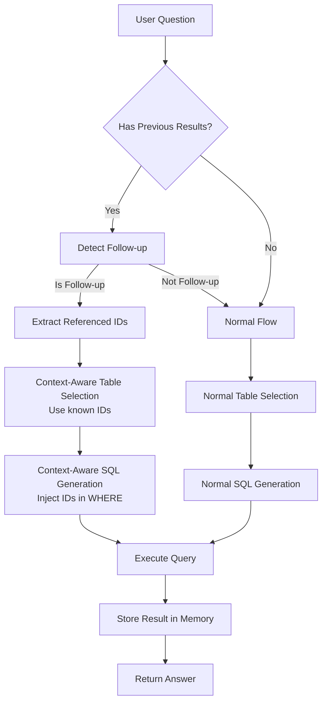

# Follow-up Question Memory System

## Overview

The Follow-up Question Memory system enables natural conversational interactions where users can ask follow-up questions that reference previous query results. For example:

**User:** "Find me the crane inspections done for the customer 'ABC COKE'"
**System:** Returns inspection with ID `abc-123`

**User:** "For that inspection, I want the questions and answers"
**System:** Uses the inspection ID `abc-123` directly instead of rebuilding the entire query

## Architecture

### Components

1. **QueryResultMemory** (`src/utils/query_memory.py`)
   - Stores the last N SQL query results
   - Extracts key identifiers (IDs) from results
   - Formats context for LLM prompts
   - Serializes/deserializes for checkpoint persistence

2. **Follow-up Detection** (`src/agents/sql_graph_agent.py`)
   - New workflow step: `_detect_followup_question()`
   - Uses LLM to classify if question references previous results
   - Extracts referenced entities and IDs

3. **Context-Aware Table Selection**
   - Enhanced `_select_tables()` to use previous query context
   - Guides LLM to use known IDs instead of rebuilding filters

4. **Context-Aware SQL Generation**
   - Enhanced `_generate_sql()` to inject known IDs in WHERE clauses
   - Skips redundant joins when IDs are already known

5. **Memory Persistence** (`src/agents/orchestrator_agent.py`)
   - Stores query results in orchestrator state
   - LangGraph checkpoint automatically persists memory
   - Memory survives across conversation turns

## Workflow



## Configuration

New settings in `src/utils/config.py`:

```python
# Follow-up Question Memory Configuration
query_result_memory_size: int = 5  # Keep last N query results
followup_detection_enabled: bool = True  # Enable follow-up detection
followup_max_context_tokens: int = 2000  # Max tokens for context
```

Environment variables (`.env`):

```bash
QUERY_RESULT_MEMORY_SIZE=5
FOLLOWUP_DETECTION_ENABLED=true
FOLLOWUP_MAX_CONTEXT_TOKENS=2000
```

## State Schema Changes

### SQLGraphState

Added fields:
- `previous_results: Optional[List[Dict[str, Any]]]` - Last N query results
- `is_followup: bool` - Flag indicating follow-up question
- `referenced_ids: Optional[Dict[str, List]]` - IDs from previous results

### AgentState (Orchestrator)

Added field:
- `query_result_memory: List[Dict[str, Any]] | None` - Persisted memory

## Usage Example

### Conversation Flow

```python
# First question
user: "Find crane inspections for ABC COKE"
system: Returns [{"inspectionId": "abc-123", "name": "Crane at the back", ...}]

# Memory stores:
{
  "question": "Find crane inspections for ABC COKE",
  "structured_data": [...],
  "identifiers": {"inspectionId": ["abc-123"], "workOrderId": ["wo-456"]},
  "tables_used": ["inspection", "workOrder", "customer"]
}

# Follow-up question
user: "Show me the questions and answers for that inspection"

# Detection:
is_followup: true
referenced_ids: {"inspectionId": ["abc-123"]}

# SQL Generation:
SELECT iqa.question, iqa.answer
FROM inspectionQuestionAnswer iqa
WHERE iqa.inspectionId = 'abc-123'  -- Uses known ID directly!
```

## Benefits

1. **Natural Conversations** - Users can reference "that inspection" naturally
2. **Performance** - Direct ID lookups are faster than rebuilding filters
3. **Accuracy** - Using exact IDs is more reliable than reconstructing filters
4. **Token Efficiency** - Reuses known context instead of re-querying
5. **Better UX** - Feels like talking to someone who remembers

## Implementation Details

### ID Extraction

The system automatically extracts ID fields from query results:
- Looks for columns ending in `Id` or `id`
- Extracts unique values
- Stores in `identifiers` dictionary

Example:
```python
data = [
  {"inspectionId": "abc-123", "workOrderId": "wo-456"},
  {"inspectionId": "abc-123", "workOrderId": "wo-789"}
]

# Extracted:
identifiers = {
  "inspectionId": ["abc-123"],
  "workOrderId": ["wo-456", "wo-789"]
}
```

### Context Formatting

Memory formats previous results for LLM prompts:

```
PREVIOUS QUERY RESULTS (for context):
============================================================

1. Question: Find crane inspections for ABC COKE
   Tables used: inspection, workOrder, customer
   Rows returned: 1
   Key IDs found:
     - inspectionId: ['abc-123']
     - workOrderId: ['wo-456']
   Sample data (first 2 rows):
     Row 1: {...}
============================================================
```

### Follow-up Detection Prompt

The LLM analyzes if the question references previous results:

```json
{
  "is_followup": true,
  "reasoning": "Question uses 'that inspection' referring to previous result",
  "referenced_entity": "inspection",
  "referenced_ids": {
    "inspectionId": ["abc-123"]
  }
}
```

### SQL Generation Enhancement

When `is_followup=true`, the SQL generator receives:

```
FOLLOW-UP QUERY - USE THESE KNOWN IDs:
======================================================================
This is a follow-up question. You have these IDs from the previous query:

CRITICAL - Include these WHERE conditions:
  - inspection.inspectionId = 'abc-123'

IMPORTANT:
- Use these exact IDs in your WHERE clause
- Do NOT rebuild the filter from the previous query
- Focus on selecting the NEW data requested
======================================================================
```

## Testing

Comprehensive test suite in `tests/test_followup_memory.py`:

1. **QueryResult Creation** - Tests ID extraction
2. **Memory Add/Retrieve** - Tests memory operations
3. **Memory Serialization** - Tests checkpoint persistence
4. **Context Formatting** - Tests LLM prompt generation
5. **All IDs Extraction** - Tests multi-result ID aggregation
6. **Implementation Validation** - Validates all components exist

Run tests:
```bash
cd api-ai-agent
source .venv/bin/activate
python tests/test_followup_memory.py
```

## Checkpoint Persistence

Memory is automatically persisted via LangGraph checkpointing:

1. After SQL query executes, result is added to memory
2. Memory is stored in `state["query_result_memory"]`
3. LangGraph checkpoint saves entire state to SQLite
4. On next message, checkpoint is loaded with memory intact
5. Memory is passed to SQL agent for follow-up detection

## Limitations

1. **Memory Size** - Only keeps last N results (default: 5)
2. **ID-Based** - Works best with ID fields (columns ending in `Id`)
3. **Single-Turn** - Doesn't handle multi-turn follow-ups ("and for the previous one before that")
4. **LLM-Dependent** - Follow-up detection quality depends on LLM accuracy

## Future Enhancements

1. **Smart Summarization** - Compress old results to keep more history
2. **Entity Linking** - Better entity resolution across queries
3. **Multi-Turn Context** - Handle references to earlier results
4. **Confidence Scores** - Add confidence to follow-up detection
5. **User Feedback** - Learn from corrections when detection fails

## Related Documentation

- [Architecture](./ARCHITECTURE.md) - Overall system architecture
- [Domain Ontology](./specialized/DOMAIN_ONTOLOGY.md) - Business term resolution
- [SQL Agent](./ARCHITECTURE.md#2-sql-graph-agent) - SQL generation workflow
