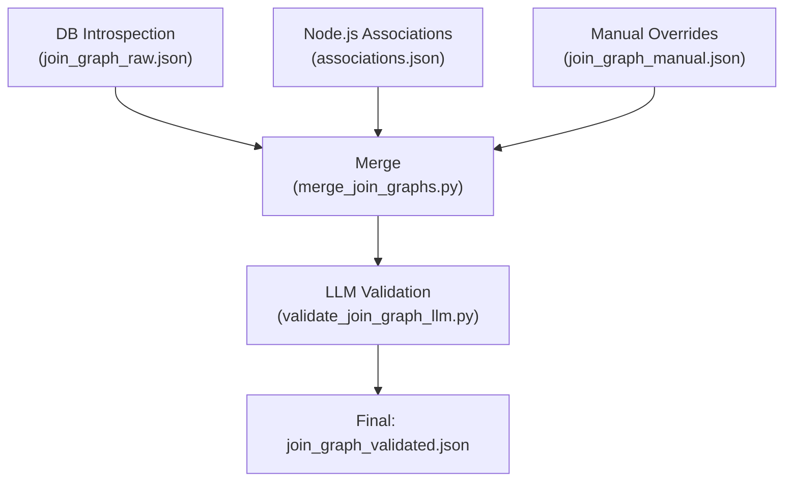

# Unified Join Graph Pipeline: Plan & Workflow

## Overview
This document describes the new join graph pipeline for the SQL agent, combining relationships from three sources:

- **Database Introspection** (SQLAlchemy, Python)
- **Node.js Entity Associations** (Sequelize, business logic)
- **Manual Overrides** (JSON file)

The pipeline produces two key artifacts:
- `join_graph_merged.json`: The canonical, merged join graph.
- `join_graph_validated.json`: The LLM-validated join graph, used in production.

---

## Pipeline Steps

### 1. Extract Relationships from Each Source

#### a. Database Introspection
- **Script:** `build_join_graph.py`
- **Output:** `artifacts/join_graph_raw.json`
- **Description:**
  - Uses SQLAlchemy to inspect the live DB schema.
  - Captures all enforced foreign keys and heuristics.

#### b. Node.js Entity Associations
- **Script:** `extract_associations.js` (Node.js repo)
- **Output:** `artifacts/associations.json`
- **Description:**
  - Parses Sequelize association definitions from entity files.
  - Captures business logic relationships not enforced in DB.

#### c. Manual Overrides
- **File:** `artifacts/join_graph_manual.json`
- **Description:**
  - Manually maintained for hotfixes, business exceptions, or temporary relationships.

---

### 2. Merge All Relationships
- **Script:** `merge_join_graphs.py`
- **Inputs:**
  - `join_graph_raw.json`
  - `associations.json`
  - `join_graph_manual.json`
- **Output:** `artifacts/join_graph_merged.json`
- **Description:**
  - Deduplicates and merges all relationships.
  - Optionally tags each relationship with its source(s).

---

### 3. LLM Validation
- **Script:** `validate_join_graph_llm.py`
- **Input:** `artifacts/join_graph_merged.json`
- **Output:** `artifacts/join_graph_validated.json`
- **Description:**
  - Validates heuristic and business/manual relationships using an LLM.
  - Only relationships passing validation are included in the final graph.

---

## Data Flow Diagram



---

## Example File Formats

### 1. join_graph_raw.json / associations.json / join_graph_manual.json

```json
{
  "version": 1,
  "tables": {
    "workOrder": { "columns": ["id", "name", ...] },
    "employee": { "columns": ["id", "firstName", ...] }
  },
  "relationships": [
    {
      "from_table": "workOrder",
      "from_column": "employeeId",
      "to_table": "employee",
      "to_column": "id",
      "type": "foreign_key", // or "business" or "manual"
      "confidence": 1.0,
      "cardinality": "N:1",
      "evidence": { "source": "db" }
    }
  ]
}
```

### 2. join_graph_merged.json
- Same format as above, but relationships are deduplicated and may have a `sources` array:

```json
{
  "version": 1,
  "tables": { ... },
  "relationships": [
    {
      "from_table": "workOrder",
      "from_column": "employeeId",
      "to_table": "employee",
      "to_column": "id",
      "type": "foreign_key",
      "confidence": 1.0,
      "cardinality": "N:1",
      "sources": ["db", "business"],
      "evidence": { ... }
    }
  ]
}
```

### 3. join_graph_validated.json
- Same as merged, but with LLM validation fields:

```json
{
  "version": 1,
  "validated_version": 1,
  "tables": { ... },
  "relationships": [
    {
      "from_table": "workOrder",
      "from_column": "employeeId",
      "to_table": "employee",
      "to_column": "id",
      "type": "foreign_key",
      "confidence": 0.95,
      "cardinality": "N:1",
      "sources": ["db", "business"],
      "evidence": {
        "llm_validated": true,
        "llm_reason": "Column is a clear FK, matches business logic."
      }
    }
  ]
}
```

---

## Summary Table

| Step                | Script/File                | Output File                  |
|---------------------|---------------------------|------------------------------|
| DB Introspection    | build_join_graph.py        | join_graph_raw.json          |
| Node.js Associations| extract_associations.js    | associations.json            |
| Manual Overrides    | (manual edit)              | join_graph_manual.json       |
| Merge               | merge_join_graphs.py       | join_graph_merged.json       |
| LLM Validation      | validate_join_graph_llm.py | join_graph_validated.json    |

---

## Notes
- Each step is modular and can be run independently.
- Only join_graph_validated.json is used by the agent in production.
- All intermediate files are kept for traceability and debugging.
