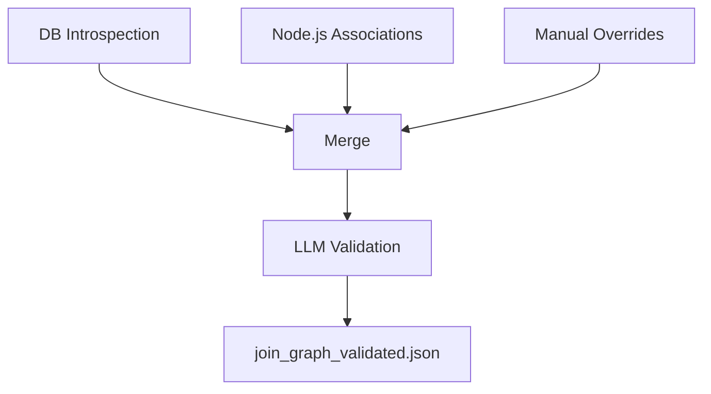

# SQL Agent: Join Graph, Path Finder & Audit Filtering

## Overview

The SQL agent uses a join graph to discover table relationships, Dijkstra's algorithm for path finding, and filters out audit columns to prevent incorrect join logic. This document covers the pipeline, path finder, and audit column filtering.

---

## 1. Join Graph Pipeline

The join graph combines relationships from three sources:

- **Database Introspection** (SQLAlchemy)
- **Node.js Entity Associations** (Sequelize)
- **Manual Overrides** (JSON)

### Pipeline Steps

| Step | Script/File | Output |
|------|-------------|--------|
| DB Introspection | `scripts/build_join_graph.py` | `artifacts/join_graph_raw.json` |
| Node.js Associations | `extract_associations.js` (Node repo) | `artifacts/associations.json` |
| Manual Overrides | (manual edit) | `artifacts/join_graph_manual.json` |
| Merge | `scripts/merge_join_graph.py` | `artifacts/join_graph_merged.json` |
| LLM Validation | `scripts/validate_join_graph_llm.py` | `artifacts/join_graph_validated.json` |

**Production**: The agent uses `join_graph_validated.json`. The join graph is loaded by `src/sql/graph/join_graph.py`.

### Data Flow



---

## 2. Path Finder (Dijkstra)

### Problem Solved

**Before**: Exponential path finding (all paths between all 122 tables = 7,381 pairs) ran forever.

**After**: Dijkstra's shortest path on-demand for selected tables. O((V + E) log V) per query.

### Components

- **`src/sql/graph/path_finder.py`** – `JoinPathFinder` class, Dijkstra algorithm
- **`scripts/build_join_graph_paths.py`** – Path index builder (metadata only)
- **`src/agents/sql/`** – Uses path finder in `nodes/join_planner.py`

### Usage

```python
from src.sql.graph.path_finder import JoinPathFinder

path_finder = JoinPathFinder(relationships, confidence_threshold=0.7)
path = path_finder.find_shortest_path("employee", "customer", max_hops=4)
```

### SQL Agent Workflow

1. **Table Selection** – Select relevant tables (3–8)
2. **Relationship Filtering** – Direct relationships + transitive paths via `expand_relationships()`
3. **Join Planning** – Optimal paths, LLM validates
4. **SQL Generation** – Uses validated paths

---

## 3. Audit Column Filtering

### Problem

The agent was using audit columns (`createdBy`, `updatedBy`) as join bridges, causing Cartesian products:

```sql
-- WRONG: Cartesian product
JOIN user ON workOrder.createdBy = user.id
JOIN inspection ON inspection.createdBy = user.id
```

### Solution

Filter audit columns **at load time** in `src/sql/graph/join_graph.py`:

```python
# src/config/constants.py
AUDIT_COLUMNS = {'createdBy', 'updatedBy', 'createdAt', 'updatedAt'}

# Filter when loading join graph
graph["relationships"] = [
    r for r in graph["relationships"]
    if r["from_column"] not in AUDIT_COLUMNS
]
```

### Correct Join Path

```sql
workOrder → inspectionTemplateWorkOrder → inspection
```

### Filtering vs. Audit in WHERE

For "Find work orders created by user X", use a **WHERE clause**, not a JOIN:

```sql
SELECT workOrder.* FROM workOrder WHERE workOrder.createdBy = :userId
```

---

## Related Files

- `src/sql/graph/join_graph.py` – Join graph loading, audit filtering
- `src/sql/graph/path_finder.py` – Path finder
- `src/agents/sql/nodes/join_planner.py` – Join planning with path finder
- `src/config/constants.py` – `AUDIT_COLUMNS`
